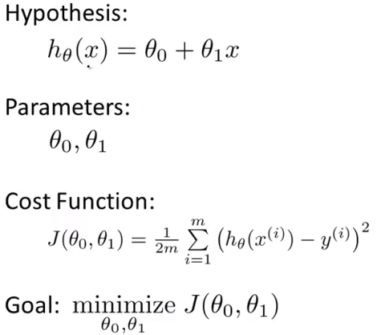
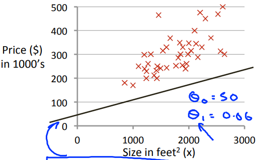
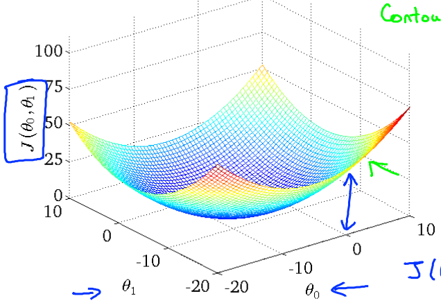
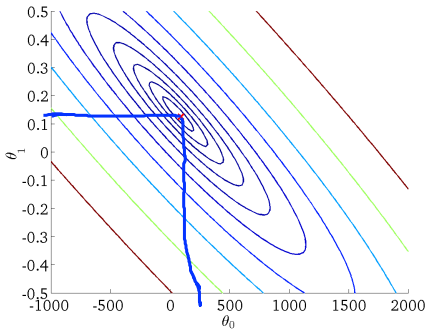
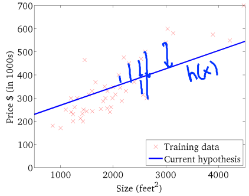

# Cost Function Ⅱ
https://www.coursera.org/learn/machine-learning/lecture/nwpe2/cost-function-intuition-ii  
線形回帰の目的関数の詳細説明2

## 線形回帰の考え方
今回は線形回帰について前回のように単純化せずに(Θ0についても)考える  

## 目的関数の考え方
以下のTrainingSet(赤×のプロット)について考える  
  

線形回帰の目的関数について Θ0, Θ1, Jの関係をプロットすると  
以下のような3次元グラフになる  
  
ボウル型をしていることが分かる  
仮説関数の最適なパラメタ(Θ0, Θ1)は J(Θ0, Θ1)=高さ が0に最も近いときであるため  
ボウルの中心であることが読み取れる  

この3次元グラフを2次元で表現すると以下になる(ContourPlots/ContourFigures/等高線図)  
  
各曲線(円を描いている線)はJを同値とする線  
(3次元グラフの 同じ高さ=Jが同値 の点を2次元にそのまま落としたイメージ)  
Jが最も0に近くなるパラメタ(Θ0, Θ1)はこの円の中心(赤点が打たれている箇所)  

中心のときのパラメタ(Θ0, Θ1)で直線を引くと以下になる  
  
TrainingSetの各プロットからの距離が近い線が引けている
