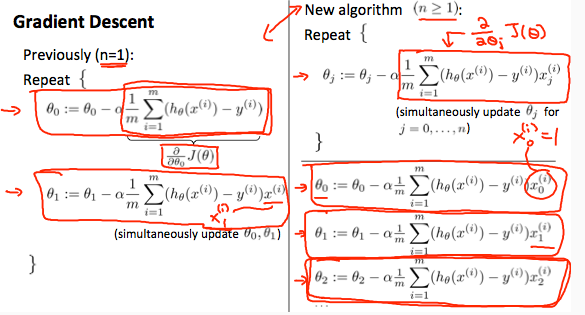

# Gradient Descent for Multiple Variables
https://www.coursera.org/learn/machine-learning/lecture/Z9DKX/gradient-descent-for-multiple-variables  
Gradient Descent(最急降下法)について  
複数のパラメタ・変数を持つ仮説の場合を考える

## Gradient Descent for Multiple Variables の式
Week1で学習した通り 1つの変数を持つ(n=1)仮説について  
Gradient Descentでパラメタを求める式は以下(左の式)の通りであった  
  
変数が複数(n>=1)になると上記の右の通りの式となる  

つまり を求める各式において n=1のときとの違いは  
末尾のの部分だけであり 複数のパラメタ・変数を持つ場合でも  
パラメタが1つの場合であるときと 大きな違いがないことが直感的にも分かる
