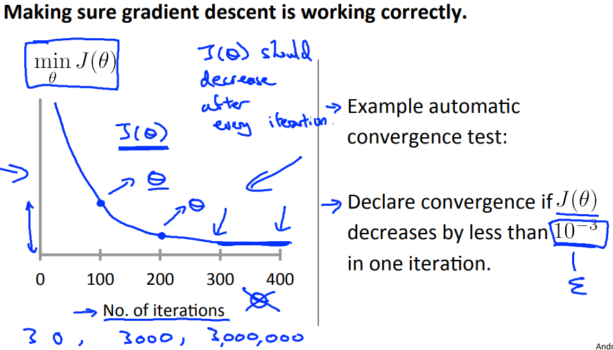
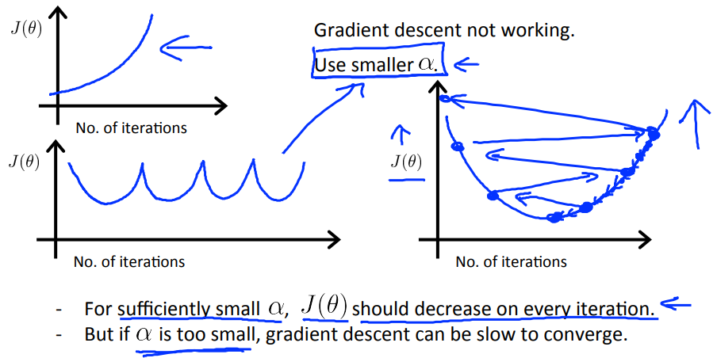
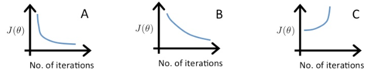

# Gradient Descent in Practice II - Learning Rate
https://www.coursera.org/learn/machine-learning/lecture/3iawu/gradient-descent-in-practice-ii-learning-rate  
Gradient Descentをより早く収束させるための手法 その2  
α(LearningRate/学習率)をどのように選択すれば良いかを学ぶ

## α(LearningRate)をどのように選択すれば良いか
x軸に試行回数, y軸にJ(θ)をとる以下のような図を作ると考え易い  
  
試行回数を重ねるごとに J(θ)の値が下がっており  
このような曲線を描けていれば良いαと考えられる

以下のように試行回数を重ねてもJ(θ)が増加してしまう場合は  
αが大きすぎることが考えられるため より小さなαの採用を考える必要がある  
  

αが小さすぎる場合 以下の図の真ん中のグラフのようになり  
試行回数を重ねてもJ(θ)がなかなか収束しないことが分かる  
  
ちなみに 左の図のようなグラフを描けるαが望ましく  
右の図ようなグラフを描く場合はαが大きすぎることが考えらえる  
