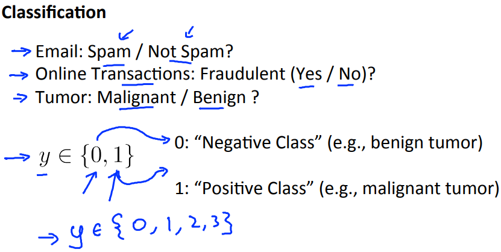
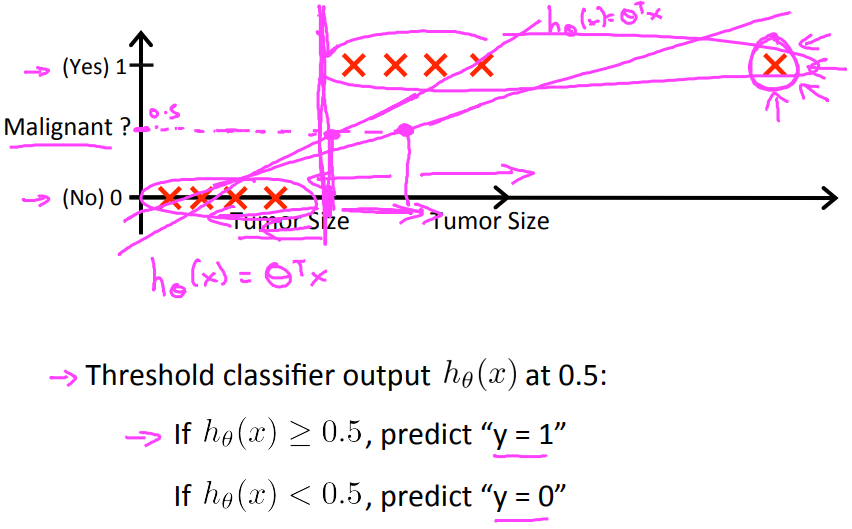
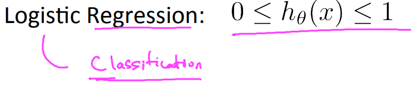

# Classification(分類)
https://www.coursera.org/learn/machine-learning/lecture/wlPeP/classification  
ここからはClassification(分類)について扱う  

## Classificationで用いる仮説
week1であったようにClassificationの事例は以下のようなもの  
  
予測する値が離散値(連続値でない)であるもの  
つまり y の値が {0, 1} になるもの(2, 3, ...など多種を扱う場合もある)  

Classificationのケースに  
LinearRegression(Regression(回帰)で扱った仮説)を適用することを考える  
  
閾値を設けることで(上記では0.5)yを 0 | 1 に分類することは考えられるが  
離散値を扱うのには LinearRegressionは最適でないと考えられる  

LogisticRegressionを用いることで  
離散値の予測に最適な 0 <= hθ(x) <= 1 となる仮説を導くことができる(らしい)  
  
