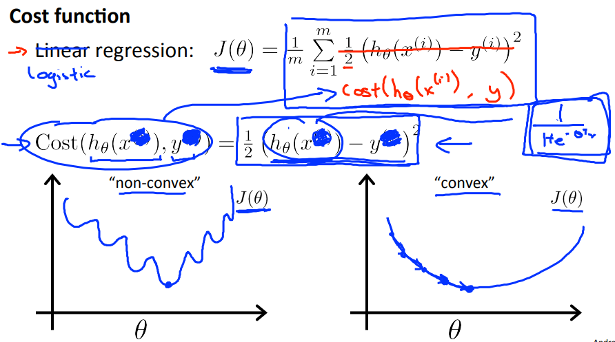
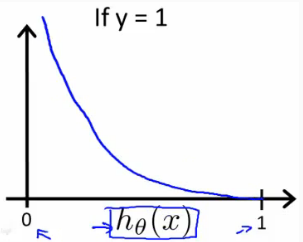
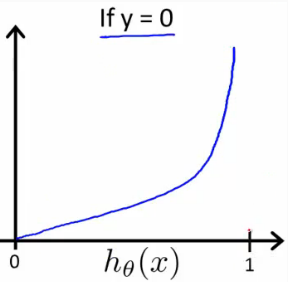
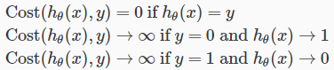
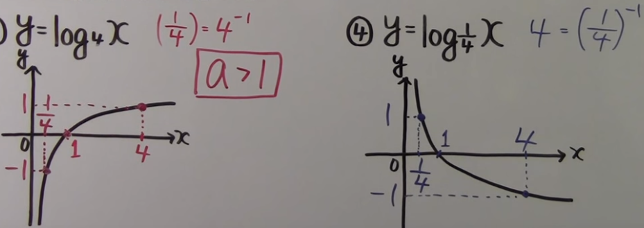

# Cost Function
https://www.coursera.org/learn/machine-learning/lecture/1XG8G/cost-function  
LogisticRegressionで用いるCostFunctionについて扱う  

## LinearRegressionで用いたCostFunction適用を考える
LinearRegressionで用いたCostFunctionは使用できない  
なぜなら LogisticRegressionで同様の関数を用いると  
non-convex(非凸)な関数となり コストを最小化するパラメタが判断できないため  
// 詳細には理解できていないけれど yは0|1 のため  
// 予測値との誤差からコスト計算しても 有効なコスト算出はできない気は確かにする  
  
つまり このCostFunctionはconvexを示す関数に対してのみ有効で  
LogisticRegressionでは別のCostFunctionを考える必要がある  

## LogisticRegressionのCostFunction
LogisticRegressionでは以下のCostFunctionを用いる  
  

この関数について図時すると以下の通り  

  
実データ(y)と 異なる予測をした場合にコストが非常に大きくなり  
正しく予測できる場合にコストが(ほぼ)0になる 適切なコスト計算ができることがわかる  

これは以下の数式で表すことができる  

## (参考) 対数関数のおさらい
対数関数(LogFunction)は以下のような曲線を描く  
  
対数関数(高校数学のおさらい)については以下の前後の動画が分かり易かった  
https://19ch.tv/km/k2m/k2m135.html  
