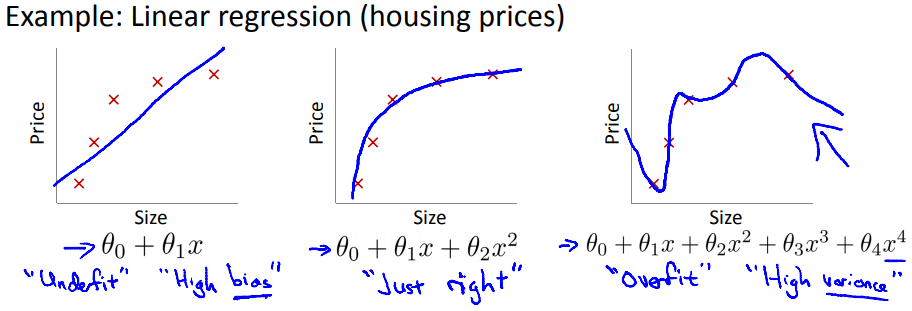
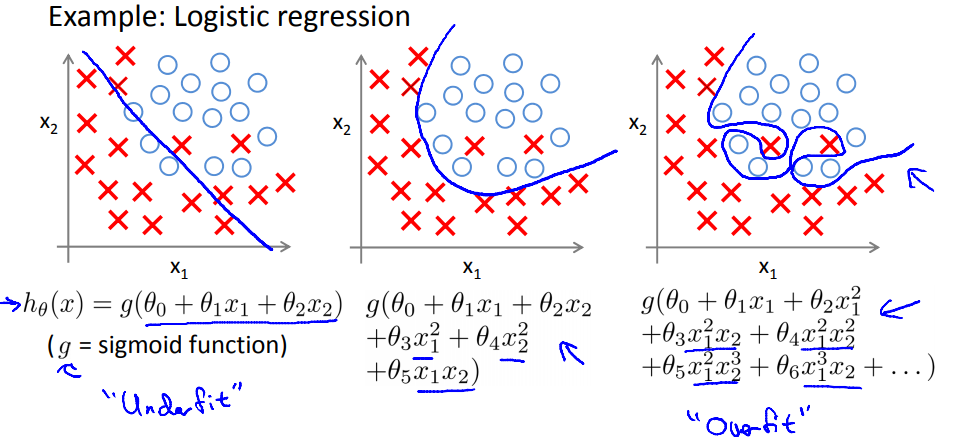
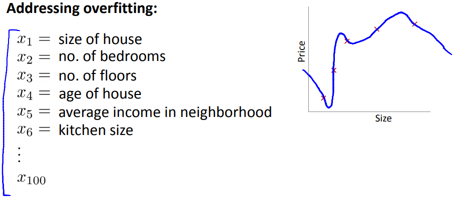
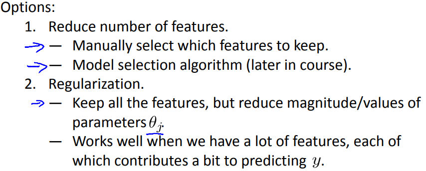

# The Problem of Overfitting
https://www.coursera.org/learn/machine-learning/lecture/ACpTQ/the-problem-of-overfitting  
オーバーフィットについて扱う

## オーバーフィットとは なにか
LinearRegressionの例を用いた場合 以下の右のケースを指す  
  
つまり トレーニングセットに適合し過ぎた仮説を導き出してしまうことで  
未知のデータに対しての予測が適切でなくなってしまった状態  

ちなみに
* 左のケースがUnderFit/HighBiasな状態  
  つまり この例だと  
  データセットは 一定Sizeを越えると Price増加量は緩やかになることを示している  
  しかし 仮説はそれが反映できておらず Sizeが上がれば それに応じてPriceは上がる  
  という バイアスが強くかかり過ぎている状態  
  仮説のモデル(次数)がシンプル過ぎて 上手く予測(フィット)できていない状態  
* 真ん中のケース は望ましい状態  
  つまり データセットに対して よくフィットできており  
  また 未知のデータに対しての予測も 適切な値を導き出せることが期待できる状態  

同様に LogisticRegressionについては 各状態について以下のようになる  
  

## オーバーフィットの対策
実際に予測をしようとすると 多くのfeaturesを扱うことになる  
これらのfeaturesをそのまま全て使用するとオーバーフィットが発生し易い(?)
  

オーバーフィットの対策として以下が考えられる  
  
2.のRegularizationについて 次回以降(?)で詳細を扱ってもらえるらしい  
