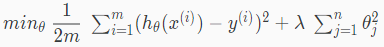

# Cost Function
https://www.coursera.org/learn/machine-learning/lecture/B1MnL/cost-function  
Overfittingに対策するためのRegularizationについて考える  
そのために RegularizedなCostFunctionについて扱う  
// 今回 あまり理解できていないかも...

## RegularizedなCostFunctionの考え方
前回 Overfittingな状態は以下右図の青線の状態と知った  
  
Overfitting解消には データセットへの過剰なフィットを導いている  
, の影響を小さくすることが考えられる  
これを実現するには CostFunctionで  
とにペナルティ(大きな係数 e.g. 1000)を与える方法が考えられる  
// CostFunctionはJ(θ)を最小化することが目的なので  
// 大きな係数が与えられたは小さく(係数が大きければ0に近い値)なることが強制される  
// ...という話だと思う たぶん  

## RegularizedなCostFunctionの関数
RegularizedなCostFunctionの式は 以下の通り  
  
λ(ラムダ)はregularization parameter(らしい)  
// 自動で決められるものなのか 明示的に与える必要があるものなのか など  
// 現時点ではまだよく理解できていない

従来のCostFunctionへ  
各θ= を出来る限り小さくしよう という考え方を追加したものと理解  
// の値が小さくなるということは  
// CurveFittingが滑らかになり Overfittingが防止できる というものと理解
