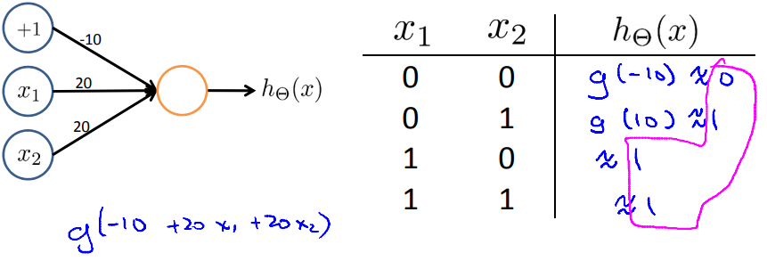
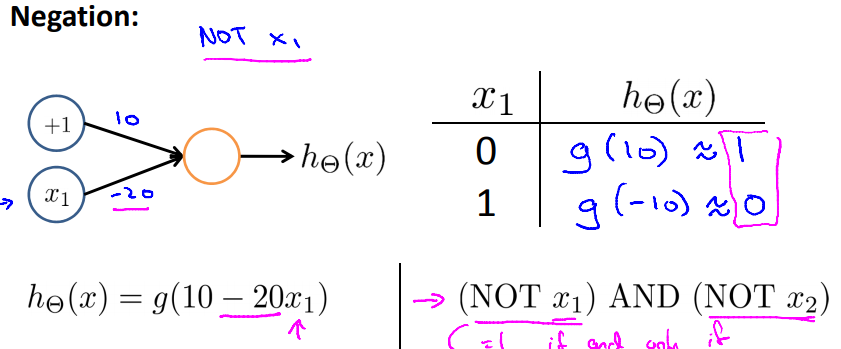
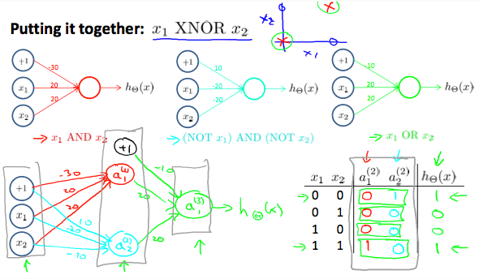

# Examples and Intuitions II
https://www.coursera.org/learn/machine-learning/lecture/solUx/examples-and-intuitions-ii  
具体例を用いてニューラルネットワークを直感的に分かるようにする  

## ニューラルネットワークの具体例 XNOR
今回はXNORについて考える(NOT OR)  

まず 前回のANDと同様  
ORについては例えば以下のパラメタ(-10, 20, 20)で実現できる  
  

NOTについては同様に以下パラメタ(10, -20)で実現できる  
  

これらのノードを組み合わせ XNORが以下の通り実現できる  
  
