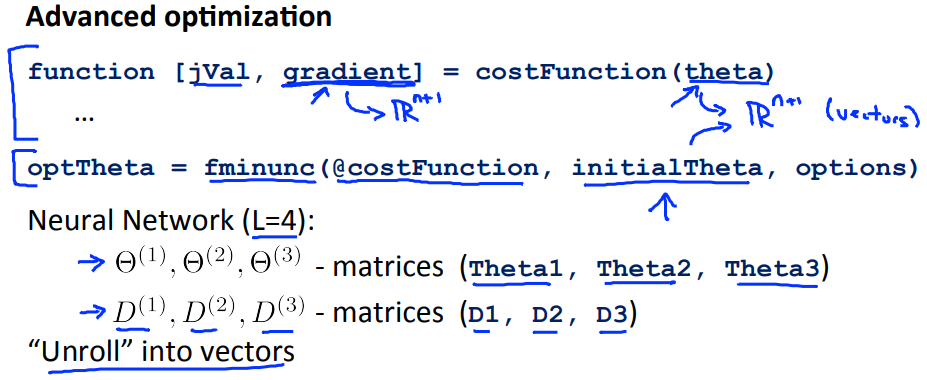
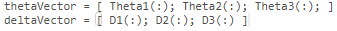
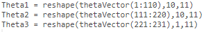
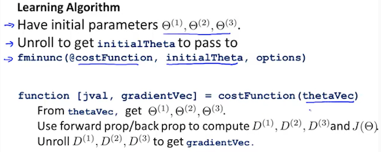

# Implementation Note: Unrolling Parameters
https://www.coursera.org/learn/machine-learning/lecture/60Uxp/implementation-note-unrolling-parameters  
NeuralNetworkでAdvancedOptimizationを使用する場合の  
Octave実装について unrollとresphare を扱う  

## Octaveのunrollとresphare
fminunc関数などのAdnvancedOptimizationでは  
引数や戻り値がベクトル(≠行列)形式の必要がある  
  
NeuralNetworkでは thetaやgradientが上記のような行列形式である  

そのため thetaやgradientはunroll(展開?)し ベクトルにする必要がある  
Octaveでは以下で 行列 -> ベクトル の変換ができる  
  

また 以下で ベクトル -> 行列 の変換ができる  
  

この変換を用いることで NeuralNetworkでAdnvancedOptimizationが使用可能  
  
1. fminuncの引数initialThetaに指定する値をunroll(行列->ベクトル)  
1. costFunctionに指定される引数thetaはベクトル化されているため  
  reshape(ベクトル->行列) この行列を用いてgradient(D)を求める  
1. costFunctionの戻り値gradientはベクトルの必要があるためDをunroll  
