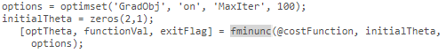
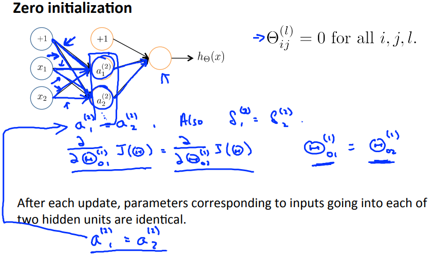
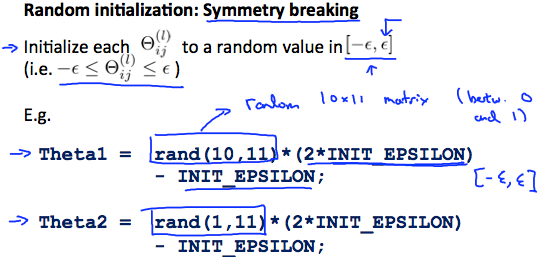
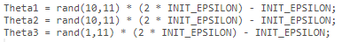

# Random Initialization
https://www.coursera.org/learn/machine-learning/lecture/ND5G5/random-initialization  
NeuralNetworkのInitialThetaについて扱う  

## NeuralNetworkのInitialTheta
GradientDescentやAdvancedOptimizationではInitialThetaを指定する必要がある  
例えばAdvancedOptimizationのfminuncは以下  
    
LinearRegressionやLogisticRegressionではこれを0初期化してきた  

NeuralNetworkで0初期化したInitialThetaを使用すると  
以降のNodesが同値になり 適切にパラメタが求められない  
    
これを回避するため NeuralNetworkのInitialThetaはランダム値を指定する  

# Random Initializationのやり方
[-ε, ε] (値域が-εからε)のランダム値を生成する方法として以下がある  

Theta1はランダム([-ε, ε])な10*11行列  

Octaveでは以下実装  
  
Octaveでrand関数は0から1の実数(0.31728とか)  
