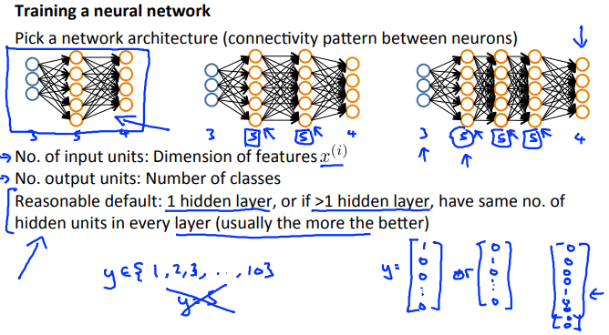
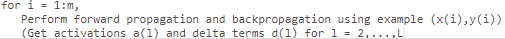
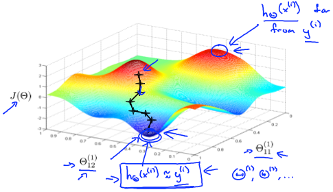

# Putting It Together
https://www.coursera.org/learn/machine-learning/lecture/Wh6s3/putting-it-together  
学んできたことを使い NeuralNetworkをどう実装したら良いか その全体について扱う  

## NeuralNetworkのArchitecture
NeuralNetworkを実装するために  
まずArchitectureを決める必要がある  
    
ここで ArchitectureはNeuronsの接続パターンを指す  
つまり HiddenLayerを何層にするか またそのUnitsをいくつにするか  

一般的にHiddenLayerは1層でも十分効果的らしい  
また Unit数はInputLayerと同じから2/3/4倍程度が良いらしい  

HiddenLayer(もUnit数も?)は より多い方が  
より良い仮説が導けることが期待できる(らしい)が 計算コストがその分高くつく  

// 結局 ここでは適切なHiddenLayer・Unit数をどう決めるかは扱っていない?  
// 聞き/読み 飛ばしているだけかも...  

## NeuralNetworkの実装手順
1. weightsをランダム値で初期化する(InitialTheta)  
1. トレーニングセットのxについて ForwardPropagation(FP)でhθ(x)を求める  
1. CostFunctionを実装する  
1. Backpropagationで偏微分を求める
1. GradientCheckingでBackpropagation(BP)で求めた値が妥当か確認する  
  確認できたらGradientCheckingは無効にする  
1. GradientDescent または Built-inのOptimizationFunction で  
  θ(weight)を使ったCostFunctionを最小化する  

FP/BP実行時は以下のようなforループで全トレーニングセットへ適用する  
    

NeuralNetwokrも何が起こっているかはLinerRegressionなどと同じく以下  
  
多くあるパラメタのうち ２つしか表現できてはいないけれど  
Gradientを利用し 予測値と実測値の差異を最小化するパラメタを求める ということ  
