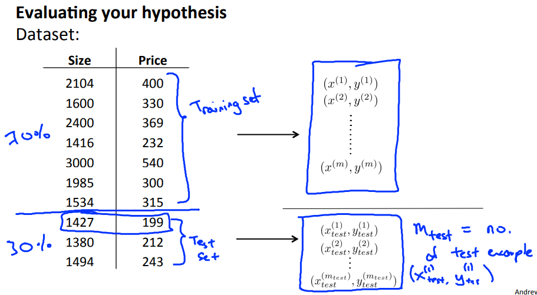
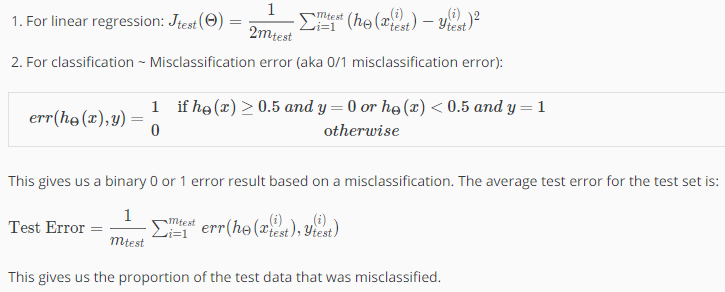

# Evaluating a Hypothesis
https://www.coursera.org/learn/machine-learning/lecture/yfbJY/evaluating-a-hypothesis  
仮説の評価について扱う  

## 仮説の評価がなぜ必要か
学んできた やり方で仮説のパラメタを導くことが出来るようにはなった  
しかし このパラメタ用いた仮説の予測値が実際には的外れだった場合  
オーバーフィットやアンダーフィットが発生している場合  
どのように対応すれば良いか 以下のような対処が考えられる  
* より多くのトレーニングセットを収集・パラメタフィッティングに用いる  
* 変数(x1, x2, ..., xi)の数を減らす/増やす
* λの値を減らす/増やす  

これらの対処をランダムに適用していると非常に時間がかかる  

仮説を評価することで 次に何をすべきか論理的に考えることができる  

## 仮説の評価・診断のやり方
仮説の評価は以下のように行う  
    
トレーニングセットをすべて学習に使うのでなく  
うち70%(目安)をいままで通り TrainingSet(学習データ)として使用し パラメタを導き出し  
残りをTestSet(テストデータ)として仮説に適用し予測値を導き出し(未知データの予測)  
予測値と実測値の差を求めることで 仮説の妥当性を確認する方法  

予測値と実測値の差を求める式は以下  
  
単に 求めた仮説でTestSetについて予測し 外れていたら1 当たっていたら0 を加算していき  
それに適当な係数を掛けた値を求めれば良い と言っているだけだと思う  
