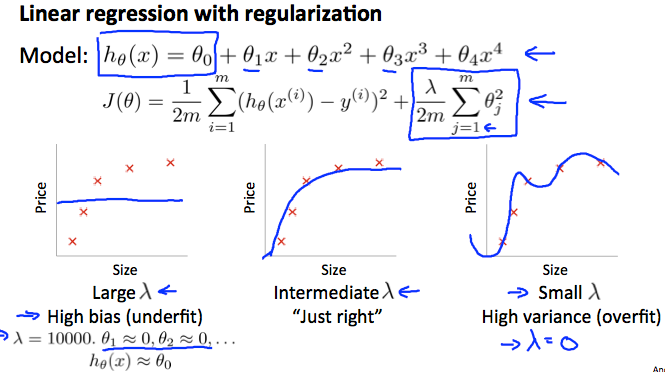
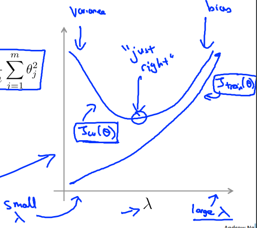

# Regularization and Bias/Variance
https://www.coursera.org/learn/machine-learning/lecture/4VDlf/regularization-and-bias-variance  
Regularizationと Bias(UnderFitting) Variance(OverFitting) の関係について扱う  

## Regularizationと Under/Over Fittingの関係
Regularizationのλの大小により 仮説は以下のように変化する  
  
つまり λが非常に大きければパラメタ(Θ)は0になるため一番左のような仮説になり  
// Θ0はRegularization対象とするため Price=0の直線にはならない  
λが非常に小さければ OverFittingな仮説になる  

## 適切なλの選び方
1. λのリスト(例えば 0, 0.1, 0.2, 0.4, 0.8, ..., 10.24)を作る  
1. 仮説のモデルをいくつか作る  
1. 作った仮説のモデル に 作ったλを適用し それぞれについてパラメタ(Θ)を求める  
1. 求めたパラメタを適用したそれぞれの仮説で CrossValidationSet(CV)のコストを求める  
  このとき Regularizationは適用しない(λ=0でコストを求める)  
1. CVのコストを最小化する 最適な組み合わせ(Θおよびλ)を求める  
1. 求めた最適なΘ(およびλ?)を使用し TestSetにおいてもフィットできることを確認する  

## λとCost(TrainingSetとCV)の関係
λ と TrainingSetおよびCVのCostには以下の関係を見ることがある  

* λが小さいと OverFitting気味な仮説になるため  
  TrainingSetにおけるCostは小さい CVにおけるCostは大きい  
* λが大きいと UnderFitting気味な仮説になるため  
  TrainingSet, CVどちらにおいてもCostが大きくなる  
