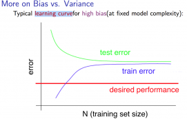
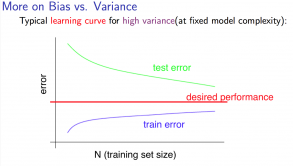

# Learning Curves
https://www.coursera.org/learn/machine-learning/lecture/Kont7/learning-curves  
LearningCurvesの考え方について扱う  

## LearningCurvesと学習データ量(数)
x軸にTrainingSetの数 y軸に誤差の平均 をとるグラフを見るとき  
TrainingSet(青線), TestSet(緑線), 望ましいケース(赤線)(\*1)について  
プロットすると以下のような傾向が見られる  
\*1: 実測値に近い予測値が出せる仮説(誤差が小さい仮説)  

仮説がHighBiasのとき(シンプルな仮説でフィットさせようとしているとき)  
  
このときは TrainingSetの数を増やしても 望ましいケースには近付けない  
つまり データ量を増やしても 仮説の改善は見込めない  

仮説がHighVarianceのとき(過度にフィットする傾向のあるとき)  
  
このときは TrainingSetの数が増えると 望ましいケースに近付くことができる  
つまり データ量を増やすことで 仮説の改善が見込める  

LearningCurvesを見ることで 学習データ量(数)を増やすことで  
仮説の改善が見込めるかの検討に役立てることができる  
