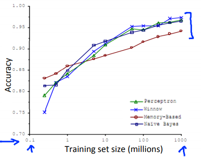

# Data For Machine Learning
https://www.coursera.org/learn/machine-learning/lecture/XcNcz/data-for-machine-learning  
MachineLearningとデータ量について扱う  

## TrainingSet(Data)SizeとAccuracyの関係
ある研究では Accuracy(予測の正確さ)とTrainingSet数について  
MachineLearningの各アルゴリズムについて以下のような結果が得られた  
  
これは アルゴリズムの精度に関わらず  
TrainingSet数が増えれば増えるほど精度が上がることを示している

ただ 実際には常にTrainingSetの数が多ければ必ず高いAccuracyが得られるわけではない  

有効なのは予測をするのに十分なFeatureがある場合  
具体的には専門家にその情報を与えたら予測値が出せるだけのFeatureがある場合  
// 例えば 家の価格を予測するのに 広さだけでは専門家では予測値が出せない  
// 加えて 築年数や立地などの情報が必要になる  

// 今回の話は OverFitting(HighVariance)のときにはTrainingSetの量が大事ということは  
// 以前既に聞いていたので 特に目新しい話ではなかったかも...?  
// この章で説明してくれていることの なにかを理解できていないだけかも。  
