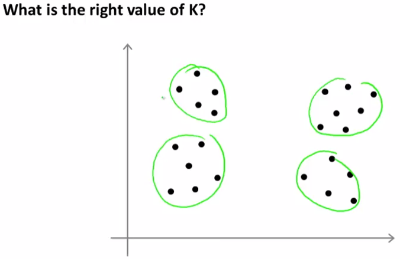
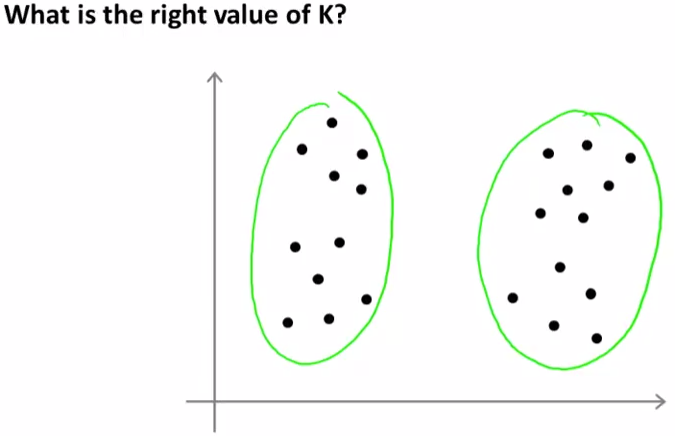
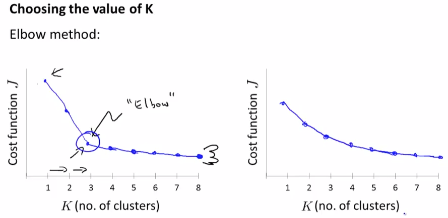
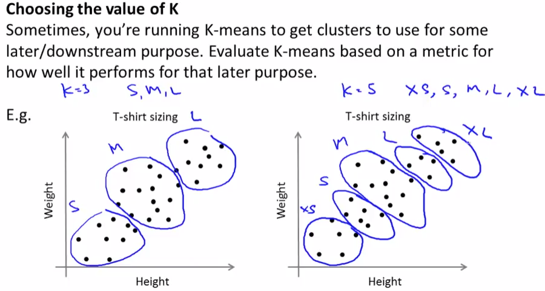

# Choosing the Number of Clusters
https://www.coursera.org/learn/machine-learning/lecture/Ks0E9/choosing-the-number-of-clusters  
Cluster数(K)の決め方について扱う  

## K-MeansのClusterの数の決め方
Cluster数を決める ベストなやり方/自動選択 は存在しない  
例えば以下Dataがあるとき Kは2にすべきかも知れないし 4にすべきかも知れない  

  
K-Meansは教師なし学習でDataにラベルがないため 自動で決められるベストなKは無い  

Kは手動で決める必要がある  
ここでは手動で決める方法を2種類 扱う

## Elbow Method
Kの決め方ElbowMethodは以下の通り  
KとCostの関係を求め Cost減少が緩やかになり始めのK(以下では3)を採用する方法  
  
ただ 右のように Kを増やすと Costが緩やかに下がり続ける傾向を示すケースが多く  
実際にはこれでKを決められるケースは多くないらしい  
// ちなみに Kを増やせばCostは減るはずで もし減らない場合  
// 局所的最小値と考えられるため ClusterCentroid初期値を変えて再度Costを求めるべき  

## 分類する目的に合わせて決める
もう1つの決め方 基本的にはこれを使う 方法は  
K-Meansで得た結果を何の目的で使うか この目的に沿いKを決める方法  
例えば 身長・体重からTシャツのサイズを分類する をK-MeansでClusteringする場合  
以下の通りKは 3 or 5 にすることが考えられる  
  
つまり ここでK-Meansの目的は Tシャツのサイズ や  
生産量(場合によってはそのサイズは生産しない) を決めことが目的で  
それを3つに分類(S, M, L)したいならK=3にすべきだし  
5つに分類(XS, S, M, L, XL)したいならK=5にすべき  
のように 分類する目的に合わせ Kを決める方法  
