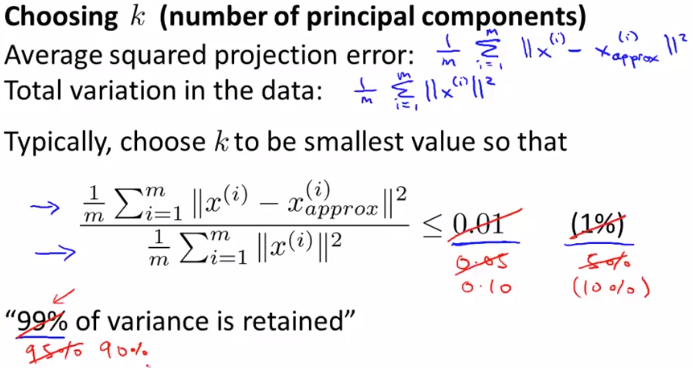
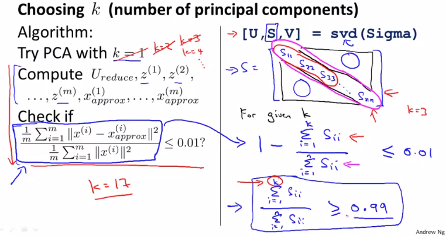

# Reconstruction from Compressed Representation
https://www.coursera.org/learn/machine-learning/lecture/S1bq1/choosing-the-number-of-principal-components  
PCAのパラメタ(k=次元をいくつへ削減するか)の選び方について扱う  

今回も何故この方法でkが求められるのか 考え方がよく理解できていない...  

## kの求め方 考え方
適切なkを選択するには以下の通り考えれば良い  
  
分子は ProjectionError(オリジナルデータ と  
PCAで次元削減したデータ がどれだけ離れているか)の平均  
分母は オリジナルデータがゼロベクトルからどれだけ離れているか 分散の平均  

この値が0.01から0.15程度に収まるようなkを選択できれば良い

この値を1から引いた数値(99%, 85%など)が 次元削減後のデータがどれだけ  
オリジナルデータの分散を保持できているかを示す  

## kの求め方 アルゴリズム
これを実現するアルゴリズムは まず以下 左の方法がある  
つまり k=1, 2, ...とそれぞれのkについて 考え方で書いた通りに値を求めるもの  
この方法だと各k毎にsvdでを求める必要があり 非常に計算コストが高い  
これと同じ値は 右のやり方でも得ることができる // 何故なのだろう...  
  
Sは`n*n行列`の対角行列(対角成分以外が0)で これを使用し  
分子にk個の対角成分の総和 分母に全対角成分の総和をとり  
これを1から引くことで 左でkにkを指定したとき求められる値と同じ値が得られる // なぜ...  
また わざわざ1から引かなくても  
この方法で求められた値が0.99(など)以上であることを確認すれば良い

これで求められた値が例えば 0.99であれば 次元削減後に  
オリジナルデータの分散の99％を保持できている と言える  
