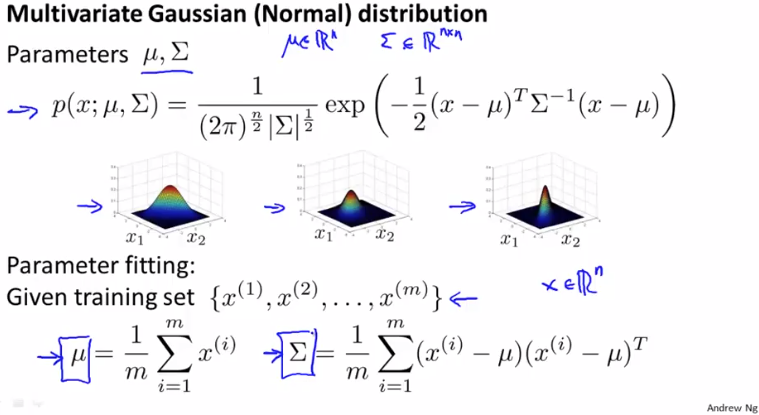
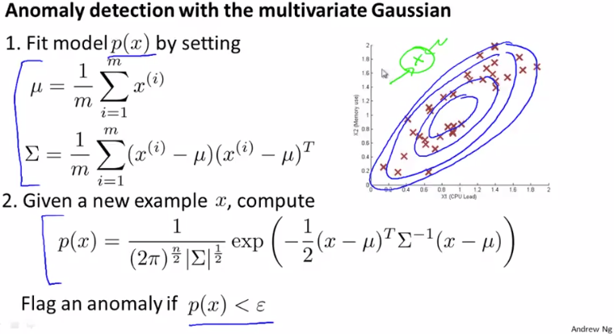
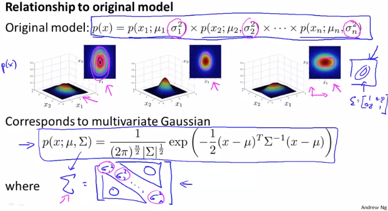

# Anomaly Detection using the Multivariate Gaussian Distribution
https://www.coursera.org/learn/machine-learning/lecture/DnNr9/anomaly-detection-using-the-multivariate-gaussian-distribution  
具体的にAnomalyDetectionの式にMultivariateGaussianDistributionをどう反映するか  
と MultivariateGaussianDistributionを用いる場合 用いない場合の比較について扱う  

## MultivariateGaussianDistributionを反映する手順
MultivariateGaussianDistributionには2つのパラメタ(μ=平均, Σ⁼共分散行列)があり  
どのように作用するかは前回扱った通り 以下は前回と同じ内容  
  
パラメタ(μ, Σ)をどう選べば良いか・Fittingすれば良いかは 上記にある通り  
μにはTrainingSetの平均をとり ΣはPCAと同じ方法で求めれば良い  
// PCAでΣを求めた方法はweek8/09_PrincipalComponentAnalysisAlgorithm参照  

こうしてμとΣをとり それを用いて以下の通りp(x)を求めることで  
Feature間の相関を反映したAnomalyDetectionが実現できる  
  
Anomalyかどうか分類するには Originalと同様 εより小さかったら で分類すれば良い  

## MultivariateGaussianDistribution版とOriginal版の関係
MultivariateGaussianDistributionを用いたAnomalyDetectionと  
用いない場合(Original)には以下のような関係がある  
  
つまり OriginalはFeatureの相関関係=0のMultivariateGaussianDistribution版てきなもの  
Originalは 他のFeatureの影響を受けず 軸(x1とかx2)に沿い分布する  

## MultivariateGaussianDistribution版とOriginal版の使い分け
以下の観点で使い分ける  
  
Original版の方がよく使われる Multivariate版の方が使用頻度は少ない  

Multivariate版はFeatureの相関関係を自動で反映したAnomalyDetectionができるけど  
`Σ(n*n Matrix)`を計算に用いるため コスト(計算量)が高く スケールしづらい  
つまり Featureが多いと 計算に多大な時間がかかり使えないことがある  

Original版は Featureの相関関係を反映したAnomalyDetectionを自動では行なえないけど  
手動でFeatureを作れば(前回の例だとCpuLoad/MemoryUsageをx3とし使用する)解決可能  
Original版は コストが低く スケールし易いため n(Feature数)が多くなっても使用可能  

Multivariate版には上記にある通り 成分の多いΣのParameterFittingできる量の  
TrainingSet(m)が必要になるため m > n(mはnの10倍など)を満たす必要などもある

つまり 以下の通り使い分けるのがおすすめ  
* Costに優れるので 手動でFeatureつくれるなら Original版を使う  
* 手動でFeatureつくる時間が無いなどで  
	自動でFeatureの相関関係を反映する必要があるときMultivariate版を使う  
