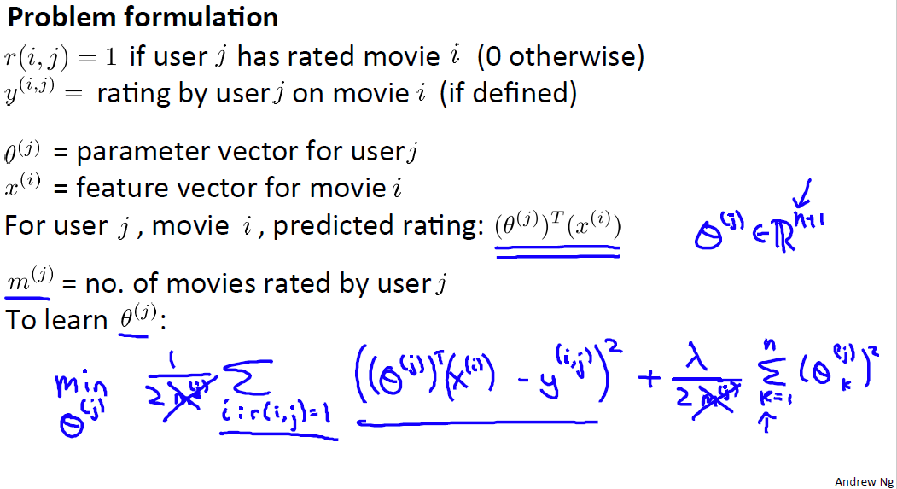
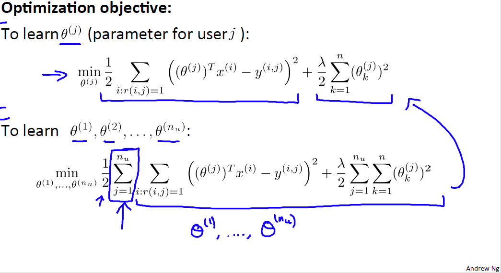
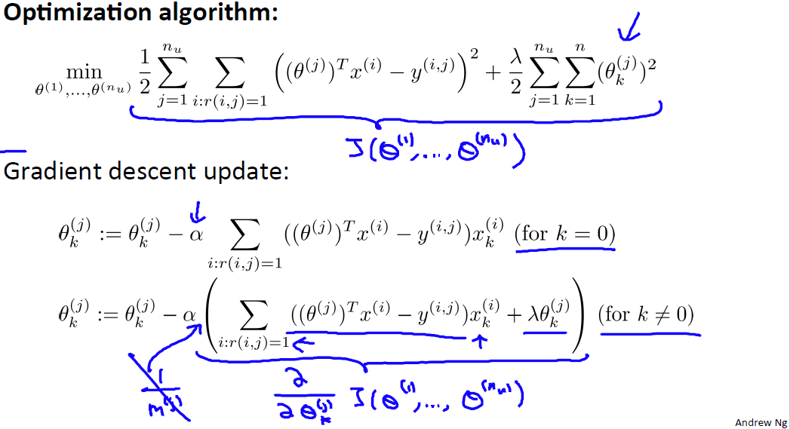

# Content Based Recommendations
https://www.coursera.org/learn/machine-learning/lecture/uG59z/content-based-recommendations  
RecommenderSystemsの1つめのアプローチContentBasedRecommendationsについて扱う  

## ContentBasedRecommendationsの考え方
前回扱った例を用いて考える  
  
ContentBasedRecommendationsでは各MovieにFeatureを手動で与え これを元に予測を行う  
今回の例では 例えばx1にRomance性 x2にAction性 のFeatureを与える  
このFeatureと 何らかの方法で求めたユーザ毎のθより ?を予測することができる  
// θの求め方についても今回扱う この例では上記θ^{(1)}が求められたと想定して進める  
例えば AliceのCutePuppiesOfLoveの予測は上記スライドの下に記載のある方法で求められる  
// x^{(3)}の先頭の1は切片項 今回は(常に?)1と置く

## θを求める式
以下の変数を定義し θを求める  
  
θ^{(j)}を求める式はユーザjのHasRatedなMovieとの誤差を最小化する単なる線形回帰的なもの  

全ユーザのθを求める式は以下の通り  
  

GradientDescentで最小化するθを求める  
(LinearRegressionと同様)k=0(=切片項=)はRegularizedする必要ないため以下の通り  
  
