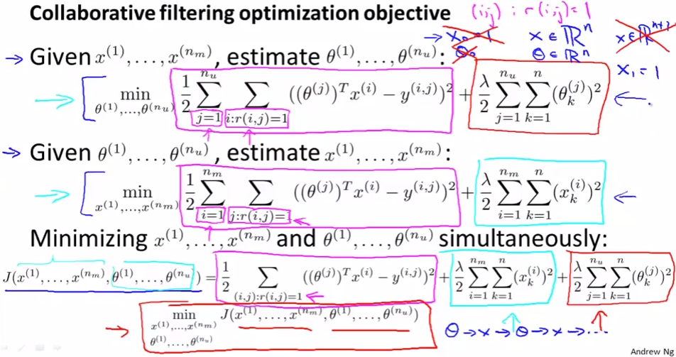
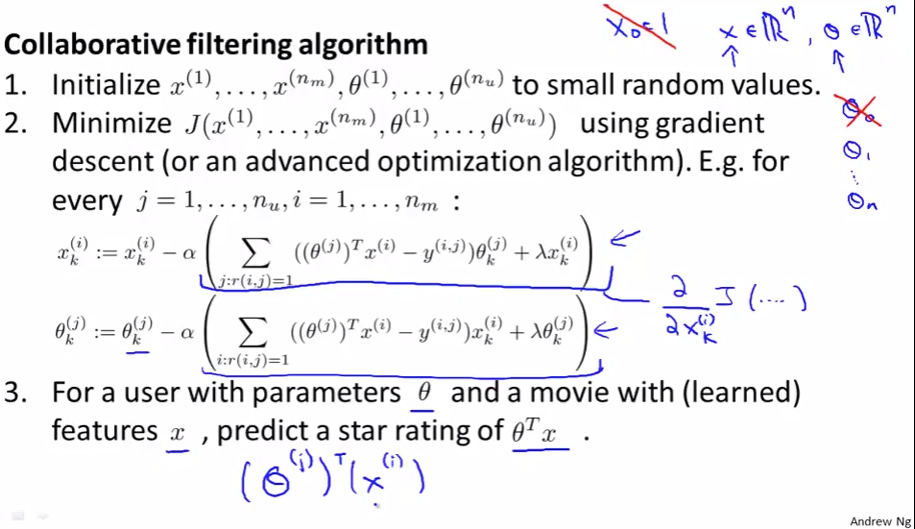

# Collaborative Filtering Algorithm
https://www.coursera.org/learn/machine-learning/lecture/f26nH/collaborative-filtering-algorithm  
前回扱った通り xが与えられればθが求められ また θが与えられればxが求められるのだった  
このCollaborativeFilteringのアルゴリズムについて扱う  

## CollaborativeFilteringのOptimizationObjective(=CostFunction?)
前回 θとxを順番に求めることを繰り返しながら 最適化していくとしたが  
前回扱った θを推計する式 と xを推計する式を くっつけて  
1つのCostFunctionでθとxを同時に最適化することを 以下の通り考える  
  
上2つの式が前回扱った式で 一番下の式がくっつけて1つの式にしたもの  

前回の例だと各変数は以下に対応するものであった  
xがMovieのFeature, iがMovieのIndex, θがUserのParameter, jがUserのIndex  

マゼンタで囲った項が同じことを指していることはパッと見だと分かりづらいが  
上については 外側のSummationで全j(User)について総和をとることを指し  
内側のSummationでRatingされている(`r(i, j)=1`) i(Movie)の二乗誤差の総和をとっており  
// ユーザを外側でループさせて 映画を内側でループさせてるイメージ  
下については 外側で映画 内側でユーザをとっているだけで 結局宇同じ値を指している  

この式が持つ性質として xを固定しθを求めようとすると上の式になるし  
θを固定しxを求めようとすると下の式になる // らしい 元の式がそうだし そんな気はする  

この式を最小化できる xとθ を求めれば良い  

ちなみに この式では`x_{0}=1`を特別与える必要はない  
これに対応するx(およびθ)が必要な場合は 自動で`x_{0}=1`を学習するため  

## CollaborativeFilteringのAlgorithm
GradientDescentを使うCollaborativeFilteringのAlgorithmは以下の通り  
  
1. x と θ を小さなランダム値で初期化する  
	すべて0など同値で初期化せず ランダム値にする理由はNeuralNetworkのときと同じ  
	NeuralNetworkのランダム初期化はweek5/06_RandomInitialization参照  
1. GradientDescentなどででJ(x, θ)を最小化する  
	// GradientDescentの場合は各x, θについて 微分する(接戦の傾きを求める)ことで  
	// Jを最小化するには x, θの増加/減少どちらが どれくらい必要か 判断し  
	// それに学習率(α)をかけた値を x,θから足し/引きし Jを最小化するのだった  
1. 求められたxとθを用いて Ratingされていない(`r(i, j)=0`)映画のRateを予測する  
