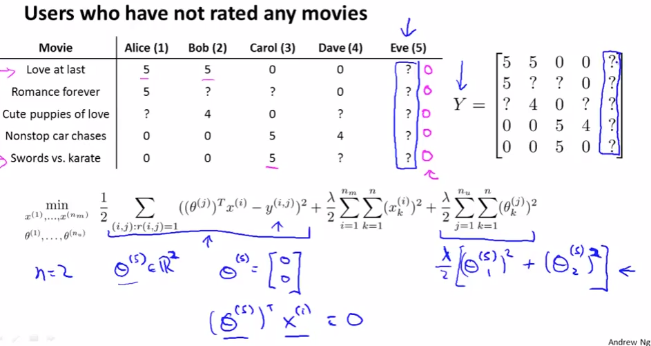
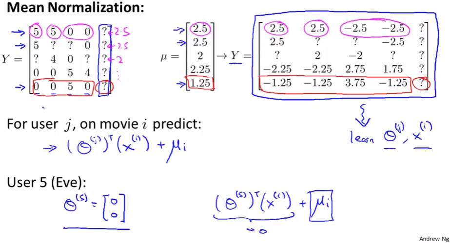

# Implementational Detail: Mean Normalization
https://www.coursera.org/learn/machine-learning/lecture/Adk8G/implementational-detail-mean-normalization  
CollaborativeFilteringのMeanNormalizationについて扱う  

## CollaborativeFilteringのMeanNormalizationのmotivation
映画をひとつもRateしていないユーザEve(5)が追加される場合を考える  
  
Eve(5)のParameter(Θ)を求めると 二乗誤差をとる項は何もしない0 (`r(i,j)=1`がないため)  
xのRegularized項も関係ないため 考えるべきはΘ^{(5)}のRegularized項のみとなる  
Eve(5)はRateしていないため(5や4にFittingする必要がないため) `[0;0]`となる  

Parameter`[0;0]`だと どんなMovieのRating予測も0となり おすすめMovieが挙げられない  
EveのようなUserにもおすすめMovieを挙げたい ような場合にMeanNormalizationが有効  

## CollaborativeFilteringのMeanNormalizationの方法
CollaborativeFilteringのMeanNormalizationは以下の通り行なう  
  
μとしてRateの平均をとる この際`r(i,j)=0` =? は無視する  
`Y := Y - μ`とする ?は無視で良い  
ここで求められたYを使用しCollaborativeFilteringを行ない ΘとxをLearnする  
Movie i, User j のRate予測値を得るにはとする  
はMovie iの平均値 CollaborativeFilteringに使用したYからはμを引いたため  
ここでμを足し戻してあげる必要がある  

ここでμを足し戻すことにより EveのRate予測値はすべて0でなく  
RateしているUserの平均値をとることができる これによりRecommendが可能になる  
