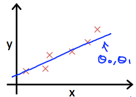

# Cost Function(目的関数)
## 仮説(hypothesis)のパラメタ(Θ0, Θ1)の求め方
仮説"hΘ(x) = Θ0 + Θ1 * x"の  適切なパラメタ(Θ0, Θ1)をどのように求めるか  
  
上記画像の直線のようなデータに適合した直線を引けるパラメタ(Θ0, Θ1)を求めたい  
これは hΘ(x(i)) - y(i) が0に近いΘが求めれば良い  
(xを仮説に入力して得られた出力 から 答えy を引いて0に近ければ良い)  

## Squared error function(二乗誤差関数?最小二乗法?)
これは以下の関数(Squared error function/Mean squared error)で表すことが出来る(らしい)
  
まだ1/2mが何なのか理解できていない  
y^は 予測値y(hΘ(x)) のことを示す
