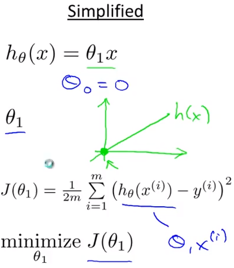
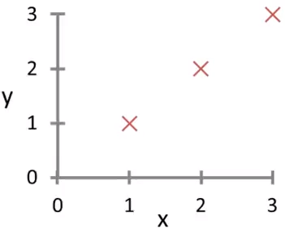
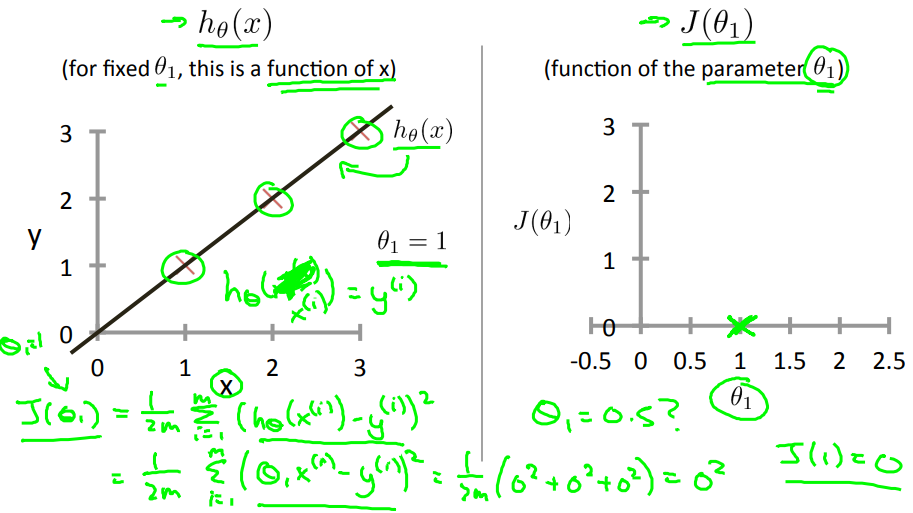
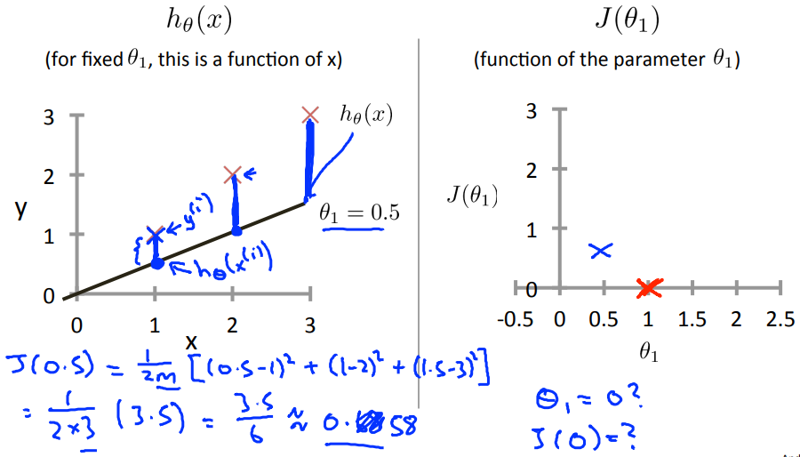
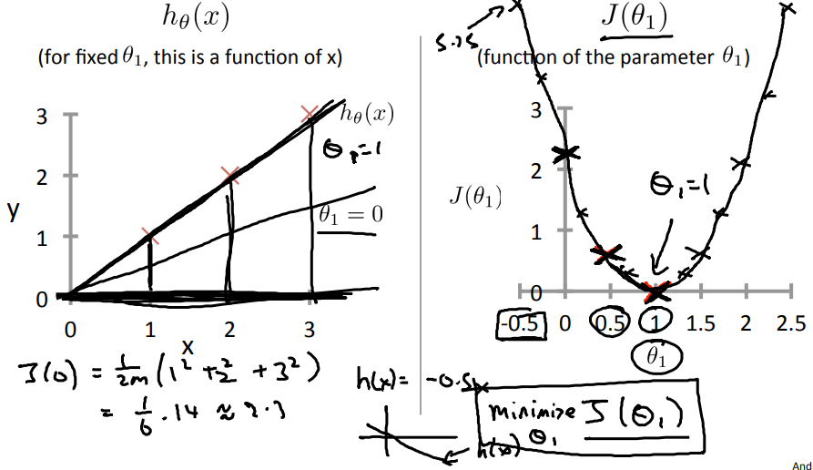

# Cost Function Ⅰ
線形回帰の目的関数の詳細説明1(単純な仮説関数について考える)
## 線形回帰の考え方
最適な線形回帰の仮説関数を求めるためには以下の通りパラメタを求める必要がある  
  

理解し易くするためここでは線形回帰の単純なケース(Θ0⁼0の場合)で具体的に考える  
  

## 目的関数の考え方(単純な仮説関数を用いて)
線形回帰の単純なケース(Θ0⁼0の場合)で具体的に考えていく  
TrainingSet(x, y)として(1, 1), (2, 2), (3, 3)が与えられた場合は以下プロット  
  

Θ1=1を考えるとき 以下の左の画像のように直線(hΘ(x))・プロット(J)が表現できる  
同様にΘ1=0.5のときは真ん中の画像，Θ1=0のときは右の画像の通りとなる  
, 
, 
  
上記の通りJが0に最も近いとき最適なパラメタ(Θ1)となることが分かる  
最適なパラメタ = TrainingSetのプロット との距離が最短な 仮説関数hΘ(x)のΘ
