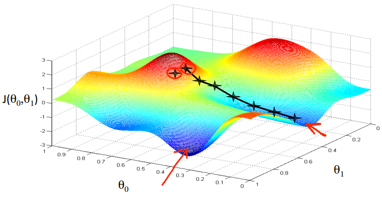
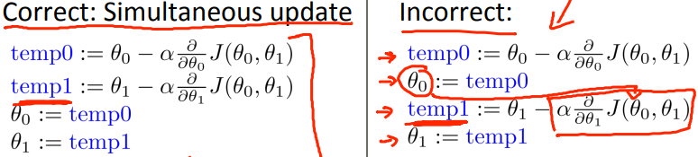

# Gradient Descent(最急降下法)
目的関数を最小化するためのアルゴリズム Gradient Descent(最急降下法)について学ぶ  

## Gradient Descentの特徴
Gradient Descentは以下の特徴がある
* 線形回帰以外にも適用可能な より汎用的な関数
* Θ0, Θ1だけでなく任意の数のパラメタ(Θn) を求めるのに適用可能

## Gradient Descentの考え方
Gradient Descentの考え方は以下の通り  
以降 考えやすいようにΘ0, Θ1についてのみ考える
1. まず任意のΘ0, Θ1を決めJ(Θ0, Θ1)を求める
1. J(Θ0, Θ1)を より 減少させられるΘ0, Θ1を求める  
   これをJが最小値(/局所的最小値)になるまで続ける  

## Gradient Descentの考え方 図で考える
これは図にしてみると以下のような考え方  
  
まず任意のΘ0, Θ1を決めると 赤丸で囲まれた×(ここでは右側の×で考える)が決まる  
Jが減少する(つまり 高さを減らせる)方向に移動する  
これを繰り返して Jが最小(/局所的最小値)になる場所まで移動を続ける のような考え方  

## Gradient Descentの考え方 関数で考える
Gradient Descentの考え方を関数で表現すると以下  
  
* := は代入を示す
* α は学習率 どれだけ大きな降下ステップを採るか制御  
  大きければ急降下し 小さければ小刻みに降下
* αにかけている項 はJ(θ0, θ1)をθjについて微分した値 つまりθjについての接戦の勾配  

それぞれのθ(θj)で偏微分することで 各θjについての接戦の勾配が求められる  
勾配を見ることで 現在地から降下するために 各軸(θj)のどの方向に進めば良いか求められる  

この関数は "Θj := xxx (for j=0 and j1)" とある通りΘ0, Θ1を更新する必要がある  
// ある時点から 各軸のどの方向に進むべきかは 同じパラメタ(θ)を元に判断する必要があるため 
  
左の順序でΘjを求める必要があり 右の順序では駄目だよ ということ
