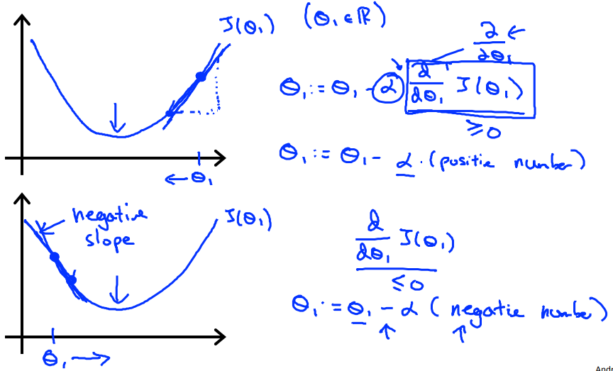
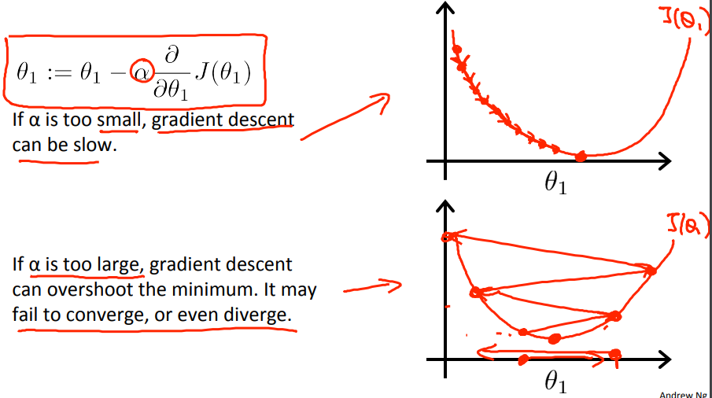
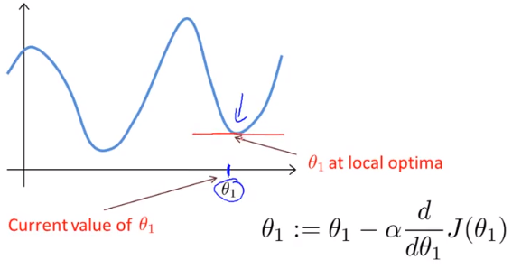
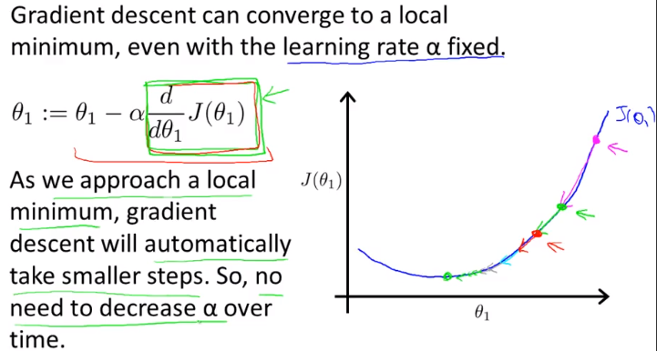

# Gradient Descent Intuition
Gradient Descent(最急降下法)の理解を深める  

## Gradient Descentの考え方(単純な関数について考える)
最急降下法の求め方は前出の通り以下  
  

ここでは 考え易くするため  
単純な関数(パラメタがΘ1のみの関数)について考える  
  
これは Θ1 は 「α」と「d/dΘ1 × J(Θ1)」 により更新されることを示している  

## d/dΘ1 × J(Θ1)とは なにか
「d/dΘ1 × J(Θ1)」は以下の通り J(Θ1)上の 特定の点の 接戦の勾配(傾き) を指す  
  
αは必ず正の値であるため(らしい)  
収束するまで以下を繰り返す式と分かる  
* 「d/dΘ1 × J(Θ1) つまり接戦の勾配」 が 正の値であるときは Θ1を減算
* 「d/dΘ1 × J(Θ1) つまり接戦の勾配」 が 負の値であるときは Θ1を加算

グラフからも これを繰り返すことでJ(Θ1)が0に(最小値に)近づくことが分かる

## αとは なにか
αは学習率 勾配に乗算される値のため  
この値が小さければ Θ1の減算/加算 が少しずつ行われ  
この値が大きければ Θ1の減算/加算 が大きく行われる  
  
αが小さいと収束するまでのステップ数が増える  
大きすぎると最急降下法が最小値を通り越し 収束しなかったり発散したりすることがある

## 収束
Θ1が最小値(または局所的最小値)になると「d/dΘ1 × J(Θ1)」(勾配)は0になり  
Θ1 := Θ1 - α × 0 つまり Θ1 := Θ1 となり収束する  
  

## αが固定なのになぜ収束するか
J(Θ1)が最小値に近づけば近づくほど 接戦の勾配は緩やかになる  
そのため Θ1 から減算/に加算する 値も小さくなるため αが固定でも収束する  
  
