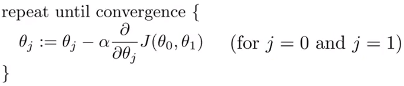
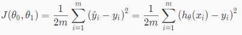
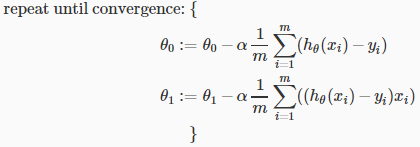

# Gradient Descent For Linear Regression
https://www.coursera.org/learn/machine-learning/lecture/kCvQc/gradient-descent-for-linear-regression  
LinearRegression(線形回帰)の場合  
GradientDescent(最急降下法)の新しい方程式が導き出される  

## 線形回帰においての最急降下法
前出の通り 最急降下法の式は以下  
  

また 前出の通り Squared error function(二乗誤差関数/最小二乗法)の式は以下  
  

これらを組み合わせると (最急降下法のJ(Θ0, Θ1)を最小二乗法の式で置き換えると)  
以下の式を導き出すことができる(式の変換過程の詳細は以降の参考項目を参照)  
  

この式を用いることで  
最急降下法 のみを用いてJ(Θ0, Θ1, ..., Θn)を最小化するときに発生する  
局所的最小値が取得される ということがなくなり 必ず最小値を取得することができる  

ということを言っているっぽいが 日本語字幕が不正確なこともあり  
理解が正しいか怪しい...

## (参考) 式の変換過程
J(Θ0, Θ1)を展開すると以下の通り  
   

この式について j = 0 の場合 を考えると以下の通り展開できる  
  

同様に j = 1 の場合 を考えると以下の通り展開できる  
  
