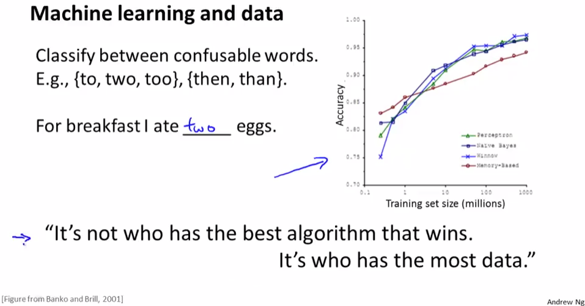

# Learning With Large Datasets
https://www.coursera.org/learn/machine-learning/lecture/CipHf/learning-with-large-datasets  
ここからはMachineLearningでLargeDataSetsを使うときのアルゴリズムについて扱う  

## LargeDatasetsが必要な理由と必要なとき
以前にも扱った通りMachineLearningにはデータ量が重要  
以下の単語を予測する例だと Algorithmによらず データ量が増えれば 予測の精度は上がる  
  

ただし データ量が増えると その分 計算量が増えてしまう  
100,000,000件のExampleDataがあるとき 常に全件データが必要とも限らない  
例えば 500, 1000, ...件をランダムに抽出してErrorを求めPlotすると以下になるとき  
  
右側のような(HighBias)傾向を示す場合は 1000件のデータから学習すれば十分と考えられる  
// このとき精度を上げるなら Feature追加 NeuralNetworkなHiddenUnitsを追加 が有効  
左側のような(HighVariance)傾向を示す場合には LargeDatasetsを使うのが有効になってくる  
// TrainingSetが増えれば増えるほど 未知データ(CV)のErrorが減る(精度が上がる)ため  

次回以降 LargeDatasetsを用いて効率よく学習するアルゴリズム  
StochasticGradientDescentやMapReduceを教えてもらえるらしい
