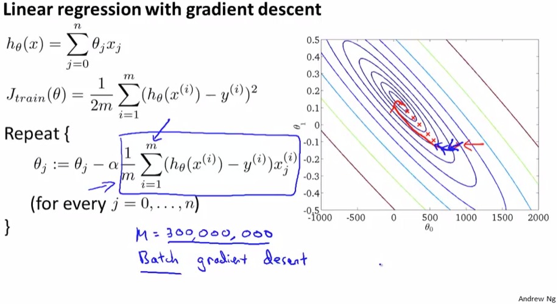
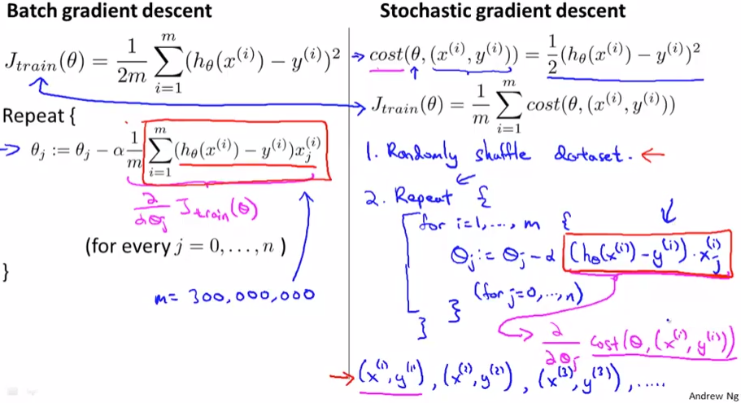
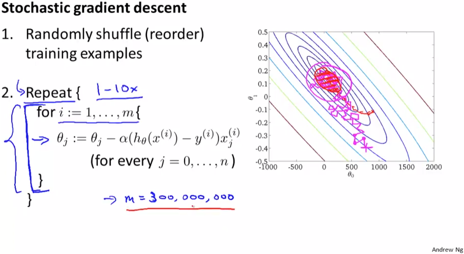

# Stochastic Gradient Descent
https://www.coursera.org/learn/machine-learning/lecture/DoRHJ/stochastic-gradient-descent  
GradientDescentをLargeDatasets向けに改変したStochasticGradientDescentについて扱う  

## BatchGradientDescentでLargeDatasetsを扱う場合
GradientDescentはLogisticRegressionやNeuralNetworkなどでも使用可能な  
一般的なアルゴリズムだが ここではLinearRegressionのケースで考える  

GradientDescentでLinearRegressionの(CostをMinimizeする)ParameterFittingする際は  
以下の通り 1回のFittinig(パラメタΘの補正)毎に全TrainingSetsを使用する  
// いままで使ってきた このGradientDescentをBatchGradientDescentと言うらしい  
  
上記のグラフで言うとParameter(Θ_{0}およびΘ_{1})を1回改善する度に  
300,000,000件のTrainingSetsについてErrorのSummationを求める必要がある  

つまり 300,000,000件の全TrainingSetsをコンピュータのMemoryに乗せる必要があり  
また 1回のParameterFittingに大量の計算が必要になる  

## StochasticGradientDescentの考え方
BatchGradientDescentに対し StochasticGradientDescentは以下の通り考える  
  
Stochasticでは 各TrainingSetのCostのSummationで全体のCostを算出すると考える(?)  
そのため 各TrainingSetについてCostが最小化できれば良いため  
まず最初のTrainingSetだけにちょっとFittingできるようにパラメタの補正を行い  
次に2番目のTrainingSetにFitting 3番目...のように各TrainingSetについてFittingする
// そのため コンピュータメモリが大量に必要でなくなったり  
// 1回のParameterFitting毎には大量の計算が不要になる  

## StochasticGradientDescentのアルゴリズム
StochasticGradientDescentは以下で実現できる  
  
Batchの場合 グラフ赤線のように各Stepで最適な補正が行われGlobalMinimumとなるが  
StochasticGradientDescentの場合はマゼンタ線のように 必ずしも最適な補正は行われず  
GlobalMinimumになるParameterを正確に求められるのでなく それに近い値に収束する  
// この それに近い値は 十分実用的なParameterであると考えて問題ない らしい  
