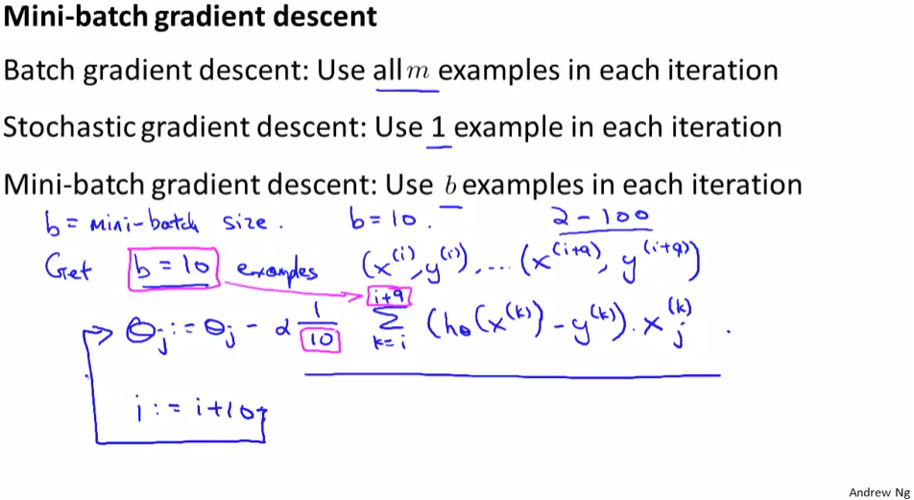
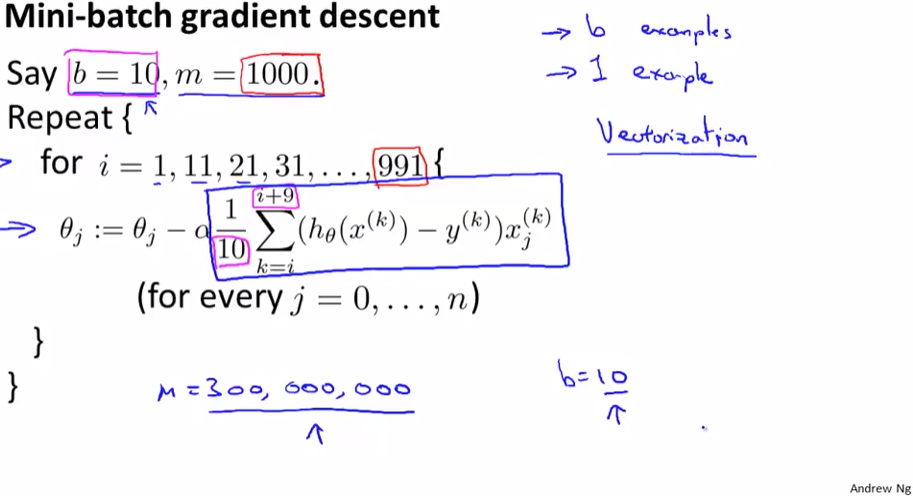

# Mini-Batch Gradient Descent
https://www.coursera.org/learn/machine-learning/lecture/9zJUs/mini-batch-gradient-descent  
GradientDescentの変種Mini-BatchGradientDescentについて扱う  

## Mini-BatchGradientDescentとは なにか
BatchとStochasticの中間のようなもの  
  
Batchは1Step(1回のパラメタ補正)毎に全TrainingSetsを使用  
Stochasticは1件のTrainingSetを使用  するのだった  
Mini-Batchはその中間 1Stepに2～100程度のTrainingSetsを使用してパラメタ補正する  

## Mini-BatchGradientDescentのアルゴリズム
1Stepに使用するTrainingSets数b=10 全TrainingSets数m=1000の場合 以下でFittingする  
  
ParameterFittingの1Stepに(1件や全件でなく)適当なMini-batch件を使用することで  
FittingをVectorizeし かつ 適宜ParameterFittingできるため  
BatchやStochasticよりも 優れたパフォーマンスをだせることがある  
