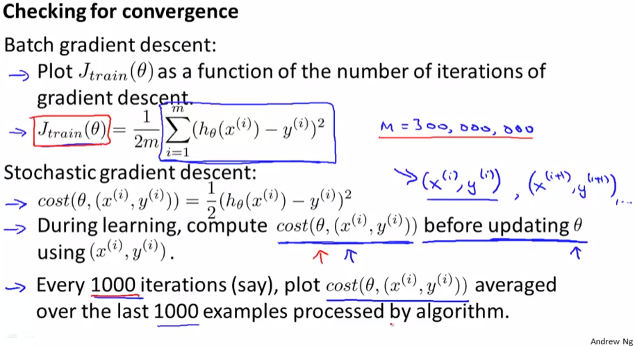
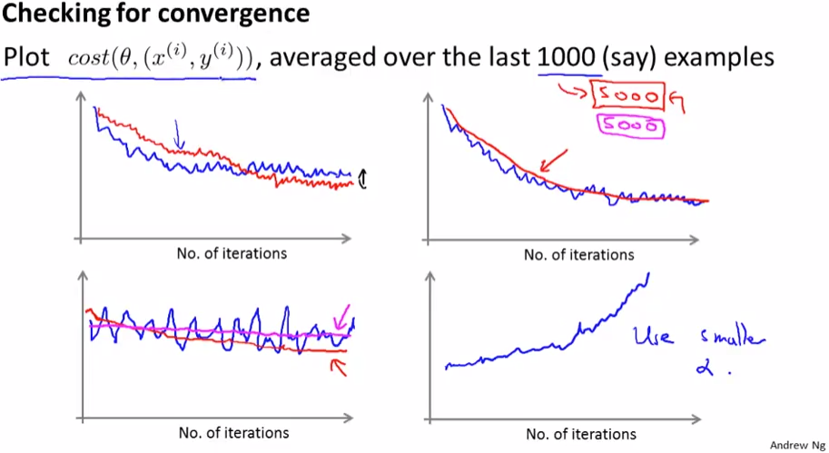
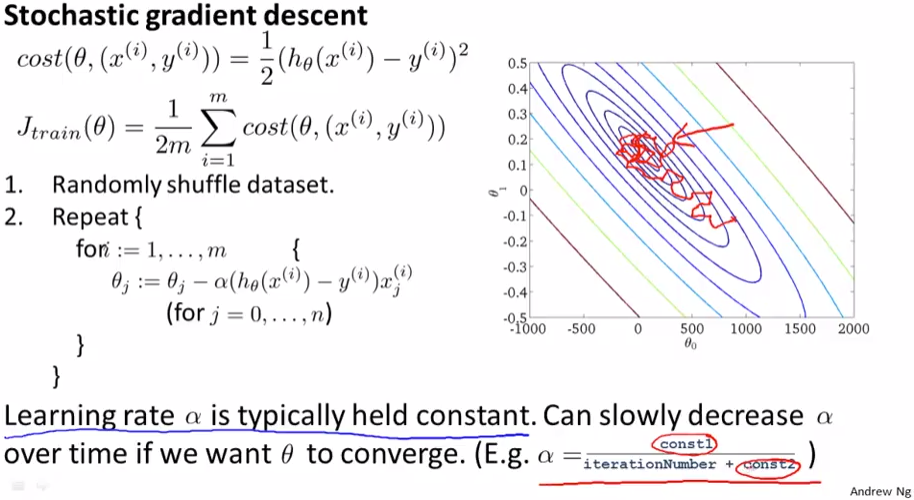
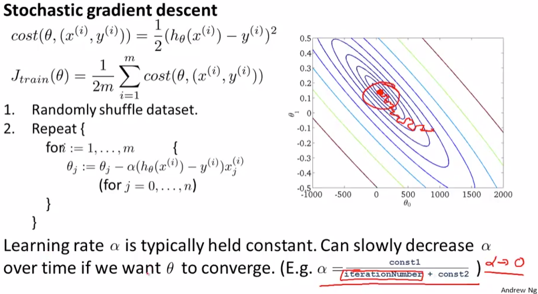

# Stochastic Gradient Descent Convergence
https://www.coursera.org/learn/machine-learning/lecture/fKi0M/stochastic-gradient-descent-convergence  
StochasticGradientDescentについて 収束の確認方法および学習率αの選び方について扱う  

## StochasitcGradientDescentにおいての収束の確認方法
BatchGradientDescentの収束を確認する際は  
各Step毎にCostを求め Iteration数とCostの関係をプロットすることで行なった  
Costは以下の通り 全TrainingSetsについてのErrorのSummationなので計算コストが高い  
  
Stochasticについては 以前も扱ったが各TrainingSet毎のCostを考えるアルゴリズム  
そのため パラメタ(θ)を補正する前に Fitting対象のTrainingSetについてのCostを求める  
これを1000件のTrainingSetsに行い平均をとりプロット 前の1000件分について比較  
とすることでBatchよりも高頻度でプロットが可能  

プロットからCostが減少してくことを確認できれば問題なく収束に向かっていると判断できる  

## Stochasitcのプロット例
StochasticでCostとIterationの関係をプロットすると以下のような結果が得られる  
  
* 左上のケースは 問題なく収束しており アルゴリズムは問題なく動作していると判断できる  
	学習率(α)をより小さな値に変更することで赤線のようなプロット結果が得られる  
	これは各IterationのParameterFittingは小さく行われるが 着実にFitしていくため  
* 右上のケースは これも問題なく収束しており アルゴリズムは問題ないと判断できる  
	青線は1000件ごとにプロット 赤線は5000件ごと のカーブを示している  
	Cost算出に使用するTrainingSets件数を増やすとスムーズがカーブが得られることが分かる  
	ただし 5000件ごとに求めると その分フィードバックが得られるのが遅くなる  
* 左下のケースは 青線は2, 3件のTrainingSetsから求めたカーブを示している  
	件数が少ないとノイジーな結果が得られることが分かる  
	このときでも 使用するTrainingSetsを例えば1000件に増やすと赤線の結果  
	正しく コストが減少していることが見えてくることもある(これはAlgo問題なし？のはず)  
	逆にマゼンタ線のように見える場合はコストが減少していないためアルゴリズムに問題がある  
* 右下のケースはCostが増加してしまっている  
	これはアルゴリズムがDiverging(分散?)していると判断できる αを小さくする必要がある  

## Stochasticの学習率αについて
Stochasticについても Batchと同様 αは固定値でも問題なく動作はする  
固定値の場合 以前扱った通り GlobalMinimumに近い値をうろうろする  
  
基本的には この方法(αは固定)が採られるらしいが  
GlobalMinimumに収束させたい場合は 以下の通りαを徐々に小さな値にさせる方法もある  
  
この方法を採ると ParameterFittingのStepはより最適な補正をしながら  
GlobalMinimumに収束するらしいけど 適切に徐々に減らすための  
const1, 2を検討する必要があり 検討にコストがかかるため 基本は固定αを使うらしい  
