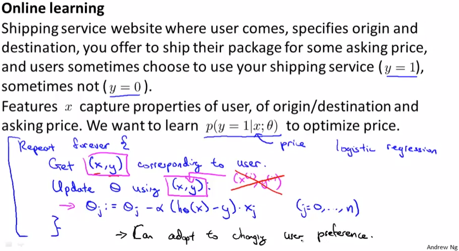
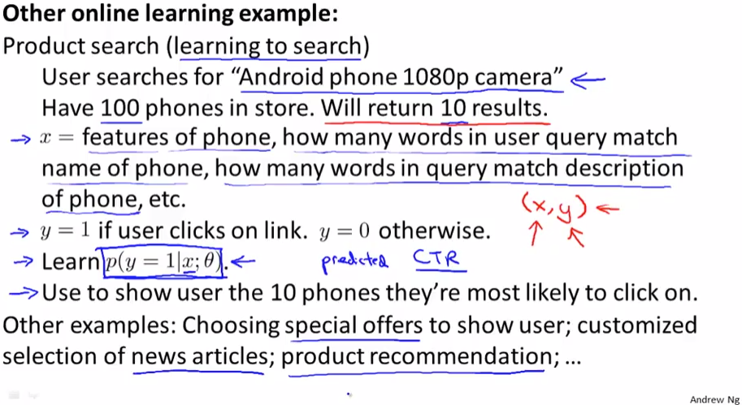

# Online Learning
https://www.coursera.org/learn/machine-learning/lecture/ABO2q/online-learning  
大規模なMachineLearningのシチュエーションの1つ OnlineLearningについて扱う  
OnlineLearningはWebサービスなどにおいて  
連続的にStreamに流れてくるDataをTrainingSetとして使用するMachineLearningのこと  

## OnlineLearningの例1 配達のWebサービス
WebSiteに訪れたユーザに配達元・先を選択して貰い 配達価格を提示  
ユーザが配達サービスを 利用してくれる(y=1) か しないか(y=0)  

Feature x(配達元・先, 価格など)から 配達を利用するか=yを予測し 価格を最適化したい  

予測にはLogisticRegressionやNeuralNetworkを用いることが考えられるが  
ここではLogisticRegressionで予測することを考える 以下の通り予測できると考えられる  
  
RepeatForeverはWebサービスを立ち上げっぱなしにしているための指定  
上記した x, yがStreamから取得できたら この1件のDataSetを使用して  
ParameterFittingを行なう これを流れてくるDataで次々に行い ParameterFittingする  

上記でDataSetにindex(i)を使用していないのは OnlineLearningでは  
学習に使った(Parameterに反映し終えた)Dataは再利用せず 使い捨てるため  

サービス利用者がちょっとしか居ない場合は いままで通りDataSetsは保存し  
(OnlineLearningでない)いままで通りのLearningを行なう方が無難っぽい  

## OnlineLearningの例2 携帯電話販売のWebサービス
WebSiteに訪れたユーザに 検索ワードを入力して貰い 100ある商品(携帯電話)のなかから提示  
ユーザが商品を クリックしてくれる(y=1) か しないか(y=0)

Feature x(検索ワードにどれだけ商品がマッチするか 商品の特徴 など)から  
クリックされるか=yを予測し クリックされそうな10商品を提示したい  

例1と同様に以下で考えることができる  
  
