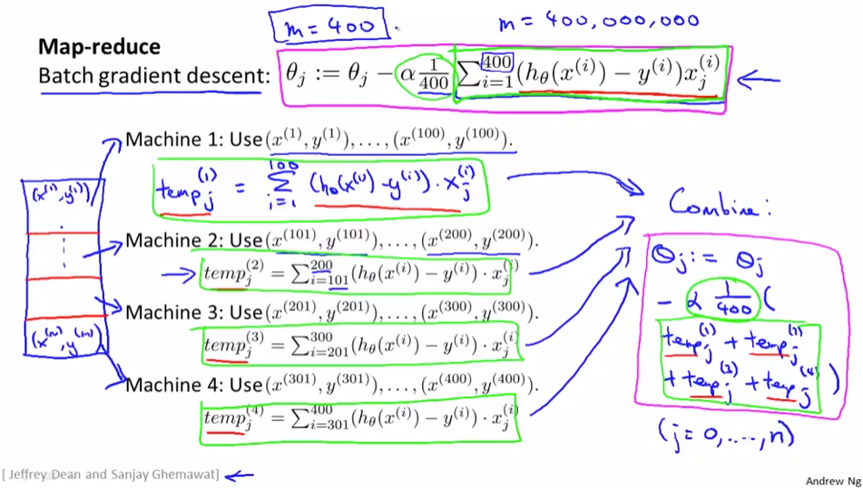
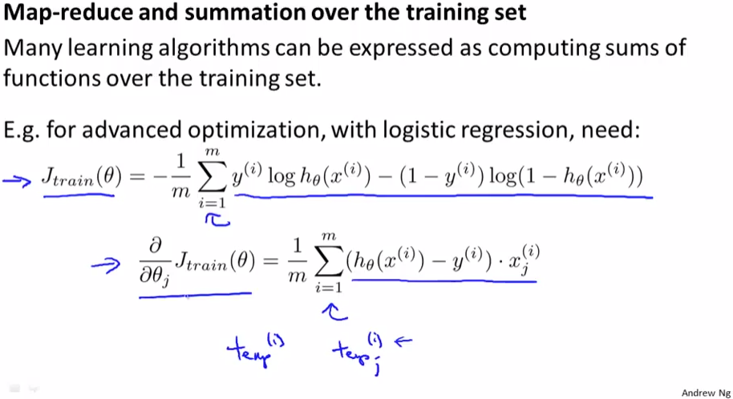
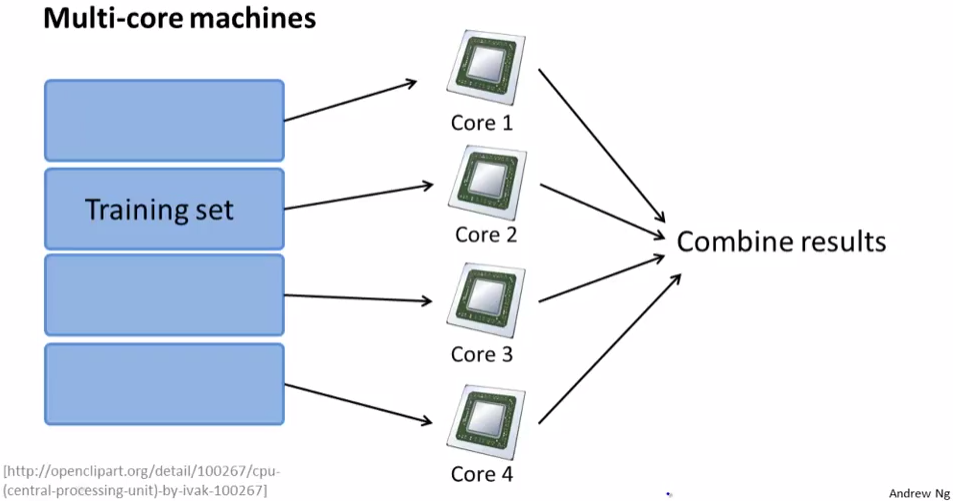

## Map Reduce and Data Parallelism
https://www.coursera.org/learn/machine-learning/lecture/10sqI/map-reduce-and-data-parallelism  
LargeDatasetsのときに有効なMapReduceについて扱う  

いままではSummationを1台のコンピュータで行なってきたが MapReduceを用いることで  
複数台のコンピュータで処理が可能になりMachineLearningを よりスケールさせられる  

## MapReduceの考え方
BatchGradientDescentにMapReduceを適用することを考える  
m=400の場合(400はMapReduceが必要になるほど大きくはないけど シンプルにするため) 以下  
  
DataSetsをMachineの数だけ分割して 各Machineで並列処理  
最後にMasterServerに結果を集めてCombineすることで より早く結果が求められる  

図示すると以下  
  

BatchGradientDescent以外でもSummation項があるようなもの  
例えばLogisticRegressionやAdvancedOptimzationにもMapReduceは有効  
  

プロセッサがマルチコアで使用するライブラリがマルチコアに対応していて  
Vectorzed処理できるアルゴリズムを実装できている場合  
1台のMachinceで並列処理が効率的にできる  
  
この場合はMapReduceが不要かも NetworkのオーバヘッドやCombine処理による遅延があるため  
