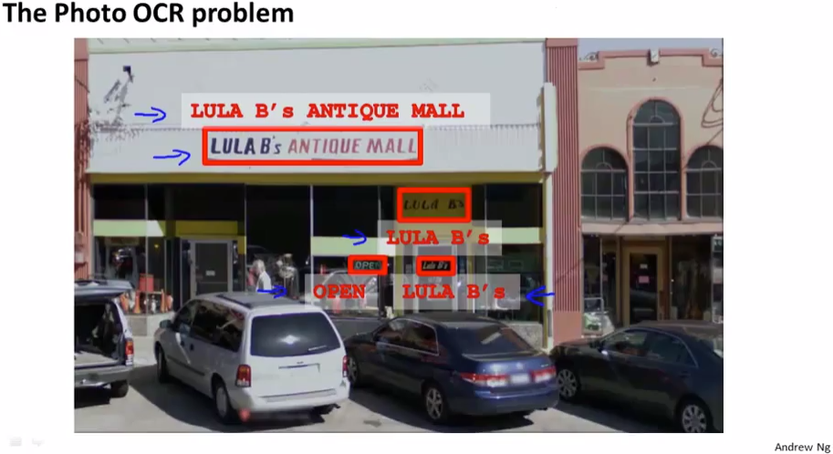
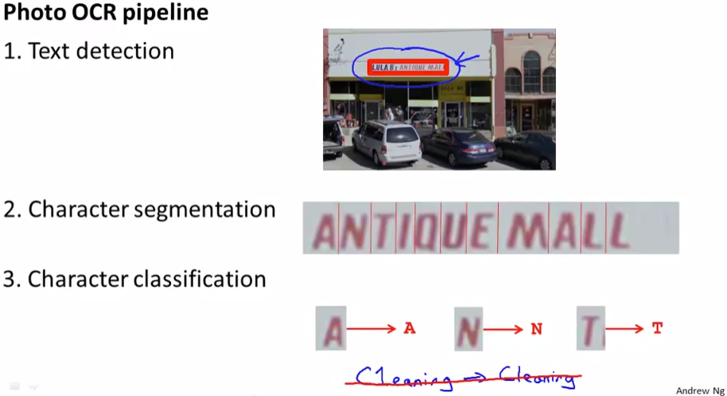
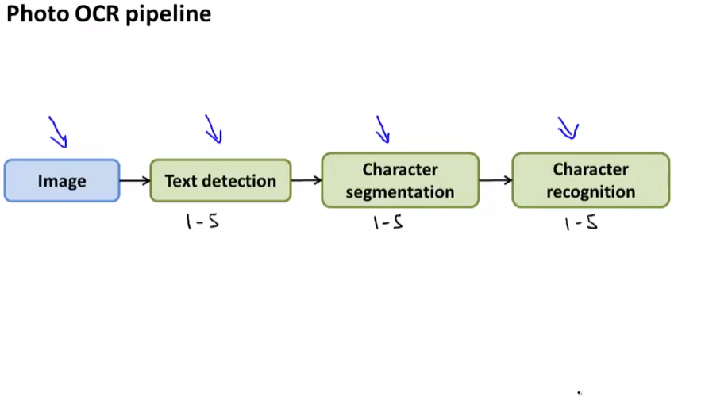

# Problem Description and Pipeline
https://www.coursera.org/learn/machine-learning/lecture/iDBMm/problem-description-and-pipeline  
MachineLearningの応用PhotoOCRについて扱う  

## Photo OCRとは なにか
Photo OCRは Photo OpticalCharacterRecognitionの略  

以下のようなTextが含まれる画像から Computerに自動でText認識させるもの  
  

## Photo OCRの実現方法
以下のように複数のシステムを組み合わせて実現する  
  
1. 画像からText部分を検出する  
1. Text部分(画像)を1文字ずつ分割する  
1. 分割された文字画像から何の文字か識別する  

上記の通り複数のシステム/モジュールから成るため 一般的に  
各モジュールに 例えば1～5名程度 担当者を割り当て 協力して開発する  
  
