# Sliding Windows
https://www.coursera.org/learn/machine-learning/lecture/bQhq3/sliding-windows  
PhotoOCRは 画像からテキスト・文字を検出 から始まる  
このとき使用されるSlidingWindowsについて扱う  

## 画像から特定オブジェクトを検出する を考えるために
PhotoOCRでは以下の左のように画像からTextを検出したいのだった  
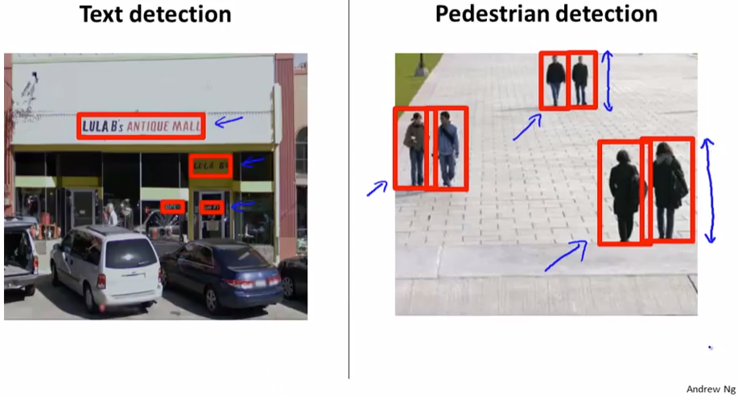  
ただTextはAspectRatio(縦横比)が一定でないため 検出が難しい(らしい)  
// らしい AspectRatioが一定でないと なぜ難しいかはこの後すぐ出てくるけど。  
そのため まずは上記の右のように歩行者(AspectRationが割と一定)を検出することから 考え  
その後に その考え方を応用しText検出の考え方について扱う  

## 画像から歩行者を検出する
以下`82*36pixel`画像をDataSets ラベル `歩行者(y=1) 違う(y=0)`とし Classifierをつくる  
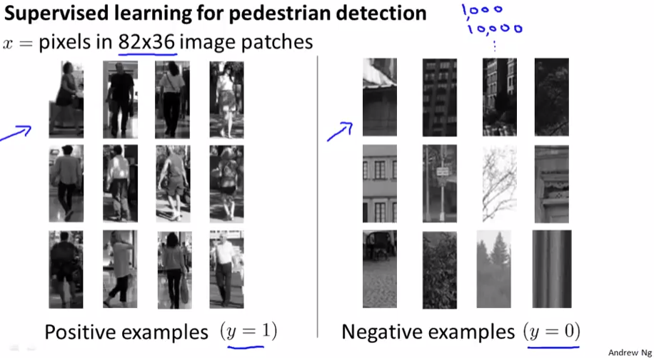  

このClassifierを使って 以下の画像から歩行者を検出することを考える  
  
画像の端から`82*36pixel`切り出し 歩行者Classifierにかけ歩行者が含まれるか判定する  
次に 数pixel分(step-size/stride)ずらした部分を切り出し 同様にClassifierにかける  
これを繰り返し 画像全体で判定を行う  

次に 歩行者のAspectRatioは一定だが カメラからの距離により倍率が異なるため  
切り出す画像のサイズを拡大して 同様に 歩行者Classifierのかけ全体を判定する  
// 拡大して切り出したときは Classifierにかける前に 画像を`82*36pixel`にリサイズする  
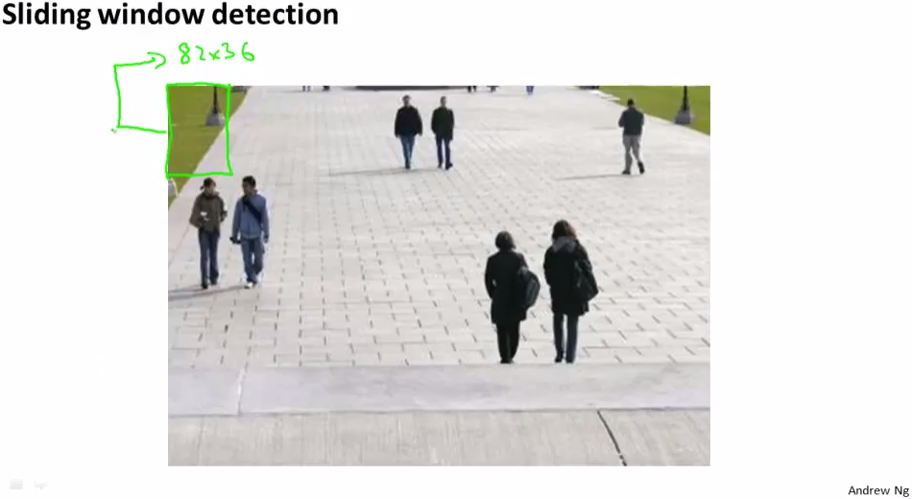  

これにより以下の通り 歩行者を検出することができる  
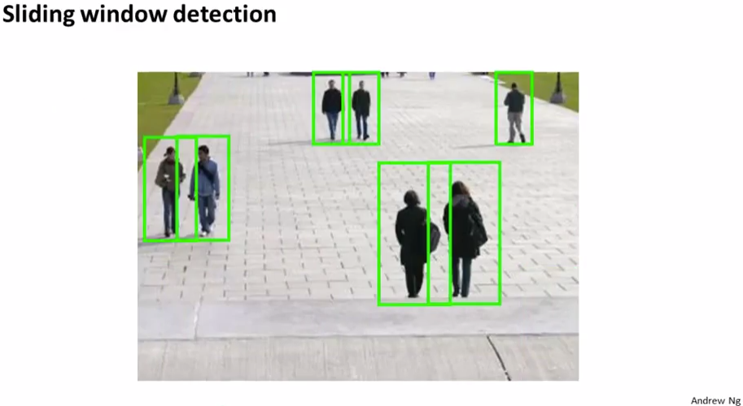  

## 画像からテキスト検出 1.テキスト部分を検出
本来の目的 画像からテキスト検出 を 画像から歩行者検出の考え方 を元に考える
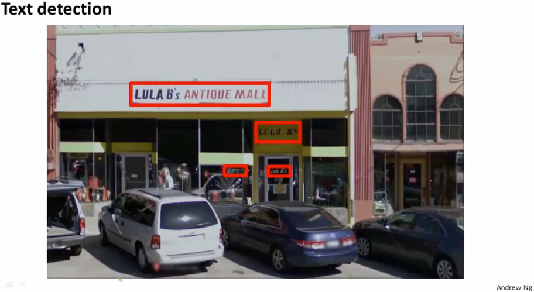  

まず 以下画像をDataSets ラベル `文字が含まれる(y=1) 違う(y=0)`とし Classifierをつくる  
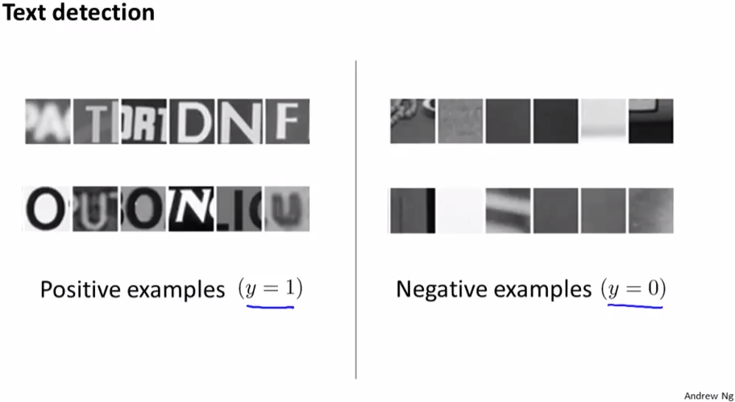  

テキスト検出したい以下の画像からSlidingWindowsで切り出して テキストClassifierにかける  
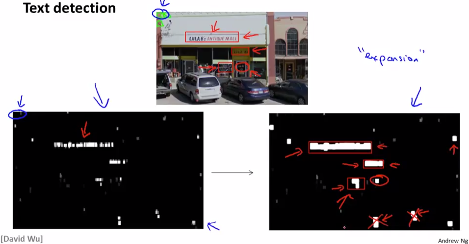  
このClassifierの結果を`テキストである確率が高いほど白 違うなら黒`で図示すると  
上記の左下のような結果が得られる  
テキストである確率が高いと判定された周りのpixelを見渡し 同様にテキストであるようなら  
周りも白として扱う の処理を行なうことで 上記 右側のように白い箱型がつくられる  

次に この箱のAspectRatioを見て 経験則からテキストじゃないっぽいところは無視する  
上記の右下画像で赤×が無視された箱  
// 赤丸の箇所(LULA B's?)は見逃し箇所らしい 確かに窓に書かれてて人の目でもかなり難しい  
この結果を次のモジュール(文字へ分割)に渡す  

## 画像からテキスト検出 2.テキスト画像を文字に分割
以下画像をDataSets ラベル `文字の分け目がある(y=1) ない(y=0)`とし Classifierをつくる  
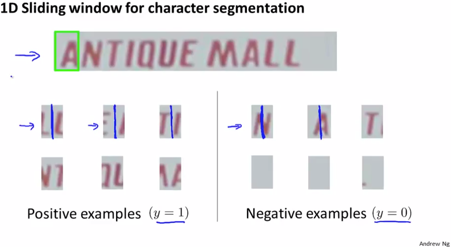  
SlidingWindowsで判定対象の画像を見ていき 分け目Classifierで判定していく  

以下のように分け目を見付けて行くことができる  
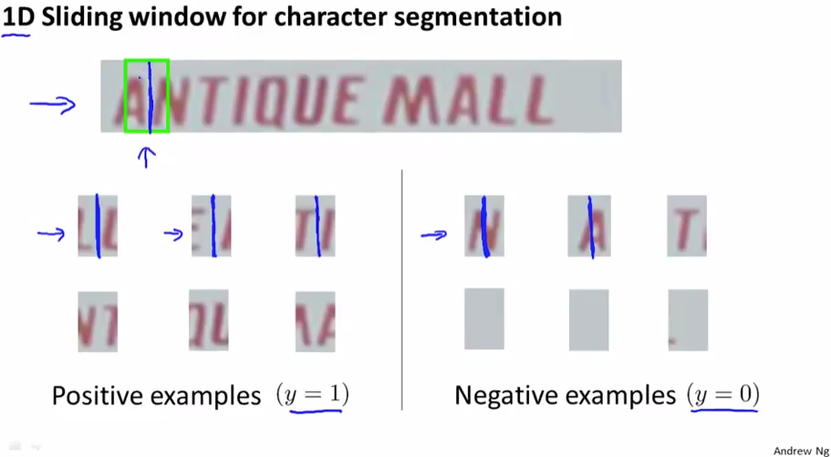
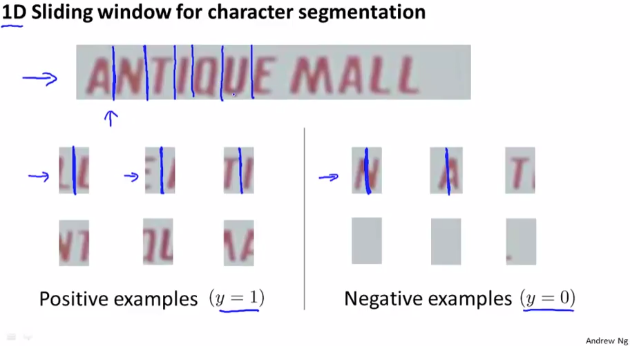  

## 画像からテキスト検出 3.文字の識別
最後に 分割された文字画像から 対象の画像の文字を識別する  
これは例えばNeuralNetworkなどを使って いままで学んできた方法で識別すれば良い  
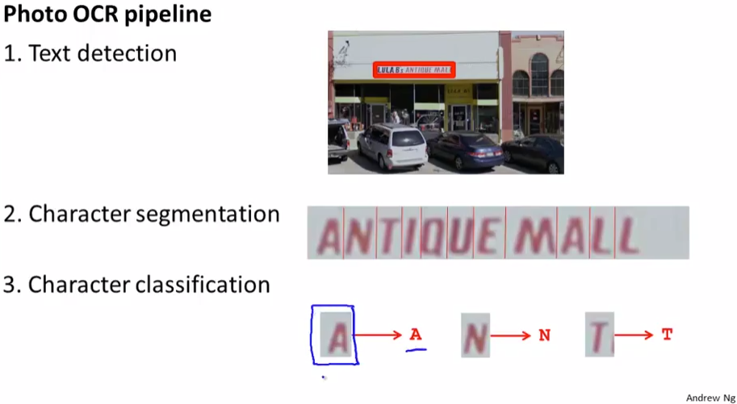  
