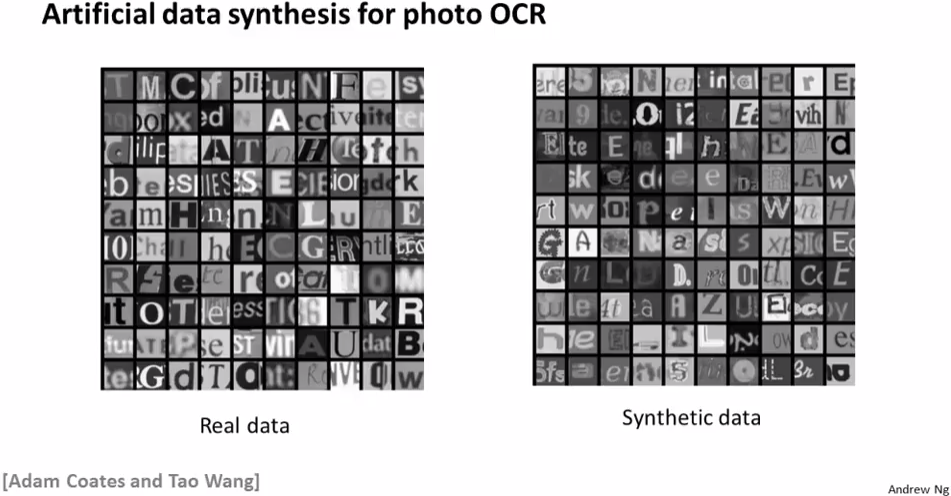
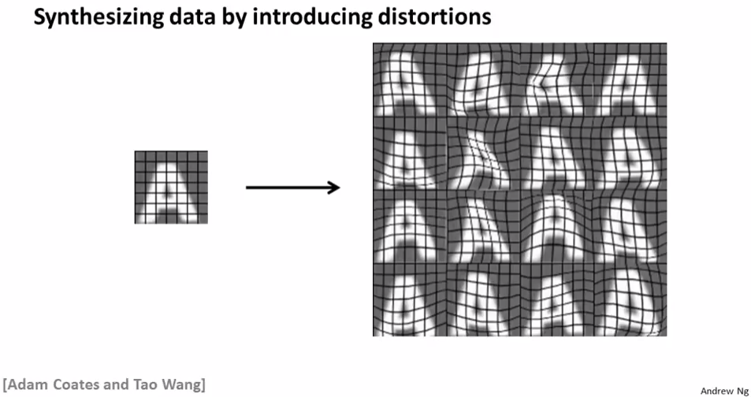
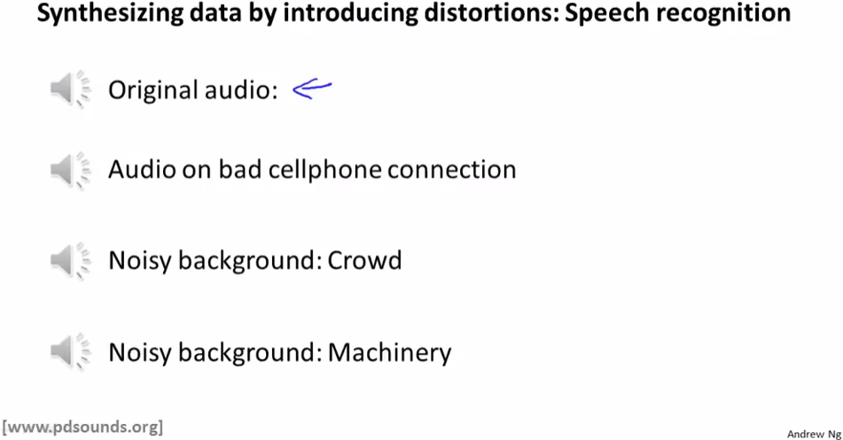
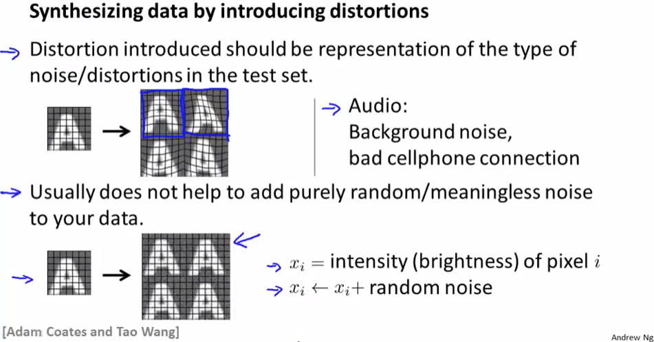
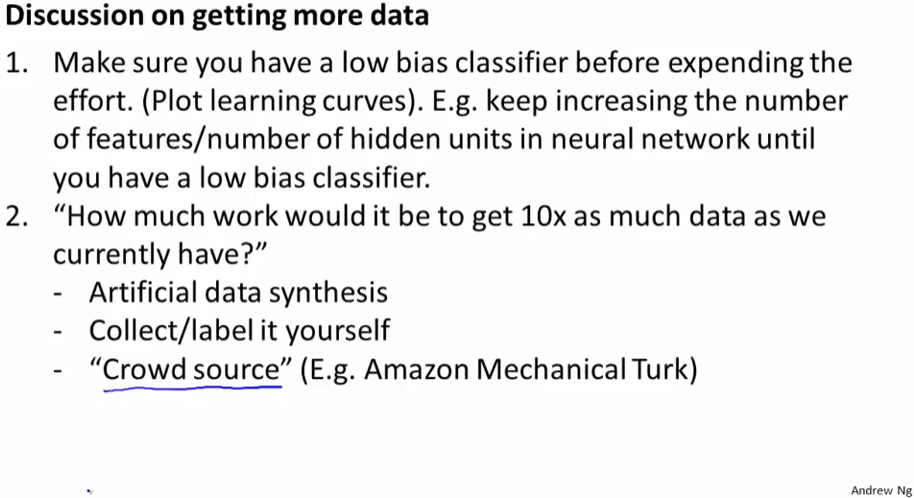

# Getting Lots of Data and Artificial Data
https://www.coursera.org/learn/machine-learning/lecture/K0XQT/getting-lots-of-data-and-artificial-data  
高パフォーマンスのMachineLearningには大量のDataSetsが重要  
DataSetsを増幅させるのに有効なArtificialDataSynthesisについて扱う  
// ArtificialDataSynthesis: 人工的に合成して作成したデータ  

## Artificial Data Synthesisとは なにか
以下の文字認識Classifierの例で考える  
  

DataSets=文字画像を集めるとき実際に外に出て写真を撮ると以下左のような画像が集められる  
// 文字認識するために色の情報は重要でないため グレースケールで良い  
  
話は変わって PCには上記右のような様々な文字フォントがあり Webにも無料フォントがある  
これをDataSetsとして利用しようと試みるのがArtificialDataSynthesisの考え方  

## Artificial Data Synthesisの作り方 文字
このフォントに適当な背景画像を合成すると 以下右のような画像を生成することができる  
  
Ditrotion(歪み)を加えることで大量のDataを生成することができる  
これをDataSetsとして利用する  

背景以外にも 文字を 拡大/縮小したり 回転したり する(アフィン変換?)ことも有効  
ただし 本物っぽい画像であることが重要なので手抜きしてテキトーな変換するのは無し  
  

## Artificial Data Synthesisの作り方 音声
Artificial Data Synthesisで音声データを作ることを考える  
音声データから何の単語が使われているか学習するためのDataSetsを考える  

1から5まで人間が数え上げるオリジナルの音声データを用意し このデータの背景に  
Distortionとして雑音を加えることでArtificial Data Synthesisを作ることができる   
  
通信状況の悪い電話越し音声っぽくしたり 道路の混雑音を加えたりすることが考えられる  
// 講義動画を見れば分かるけれど 人間の耳で聞いて 言っている単語が識別できる程度の雑音  

## Distortion(歪み)について
適当な背景を追加したりすることが有効なDistortionで  
例えば 人間が識別すべき変化が有効に現れないこと  
画像の各pixelにランダム値を足し/引き などは Distortioonとして有効ではない     
  

## Artificial Data Synthesisする前の留意事項
Artificial Data Synthesisでデータを増幅を行なう前に 留意が必要なこと  
  
1. LargeDatasetsが必要な状況であることを確認すること  
	つまり ClassifierがLowBiasな状態であること をLearningCurvesをとって確認すること  
	これまでにも扱ってきた通りHighBiasな状況ではFeature追加などをまずは試すべき  
	// week10/01_LearningWithLargeDatasets などを参照  
1. 例えば10倍のDataSetsを(ArtificialDataSynthesisでなく)実際に集める場合  
	どの程度の時間がかかるか机上で試算すること  
	`DataSet 1つ得るのに必要な時間(10秒とか) * 必要なDataSets数`で試算する  
	試算結果で大きな工数が必要でなさそうであれば 実際にData収集すれば良い  

	ちなみにDataSetsを収集する方法としてクラウドソーシング(他者/社にお願いする)  
	も割と使われていて AmazonMechanicalTrunkとかがメジャーらしい  
	
