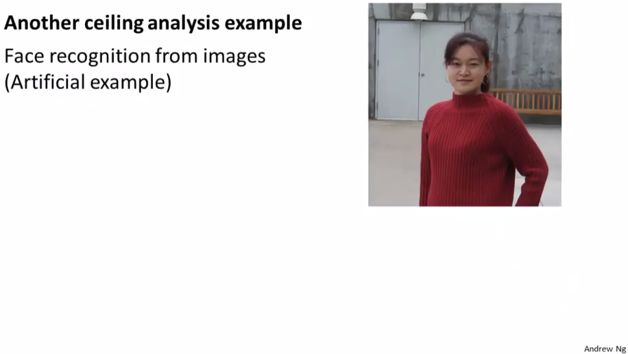
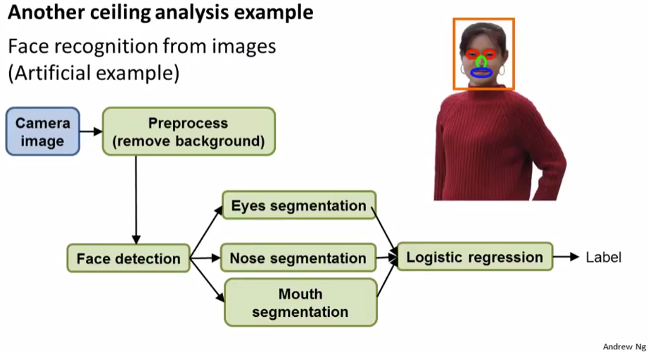
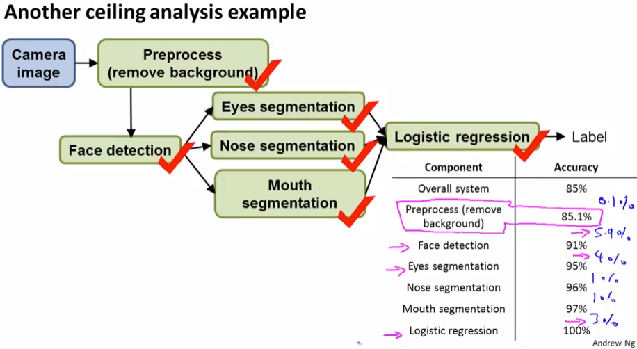

# Ceiling Analysis: What Part of the Pipeline to Work on Next
https://www.coursera.org/learn/machine-learning/lecture/LrJbq/ceiling-analysis-what-part-of-the-pipeline-to-work-on-next  
複数のコンポーネントの組み合わせによるMachineLearningシステムを実装する際  
精度向上にどのコンポーネントを改善すべきか その分析に有効なCeilingAnalysisを扱う  

精度(Accuracy)を上げるために 直感など根拠なく改良対象コンポーネントを選んでしまうと  
Developerの貴重な時間を浪費してしまう恐れがある 適切に改良対象のコンポを選ぶ方法    

## Ceiling Analysisとは なにか
Photo OCRの例で考える これは以下3つのコンポーネント(コンポ)からなるシステム  
このシステムのAccuracyが現在72%で コンポの改良を検討している  
  
このとき 1個目のコンポ=TextDetectionの出力 つまり画像のテキスト領域検出を  
手動で精度100%になるようデータを作り 次のコンポに渡すようにし Accuracyを求める  
次に2個目についても同様に手動で100%にしAccuracyを求める  
と続けることで 各コンポの精度が100%になったときの Accuracyの上昇を知ることができる

ここで得られたAccuracy上昇が 各コンポを完璧に実装するときのAccuracy上昇の上限(Ceiling)  
なので 上昇が大きいところ 今回はTextDetectionコンポの改善効果が最も高い と分かる

## Ceiling Analysisの例 顔認識
以下のような画像から顔を認識し 友だちかどうかを判定する システムを考える  
  

このシステムのパイプラインは以下が考えられる  
  
// ただ実際の現場で顔認識する際は この通りでは無いけどね 的なことも仰ってたように思う  
背景を除去し 顔の位置を検知し 顔から 目・鼻・口を認識して ラベル付けするパイプライン  

このパイプラインについても同様に CeilingAnalysisを行なうことで  
以下のように各コンポを改善したときの Accuracy向上の上限を分析することができる  
  
つまり 顔や目の検知コンポを改良することが効果が大きく 背景除去コンポ改良の効果は小さい  

ちなみに背景除去コンポの効果が小さい は実際にもみられたことがある事例らしい  
2人のDeveloperが1.5年かけて論文書けるくらい頑張って改良したけど  
Accuracyの向上への寄与は小さかったらしい  
なので 直感で改良するコンポ決めて そこにリソース/時間突っ込むと勿体ないから  
CeilingAnalysisとかでちゃんと分析しようね と言うお話だった  
