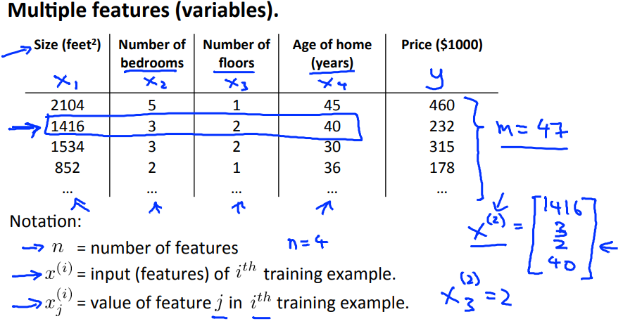
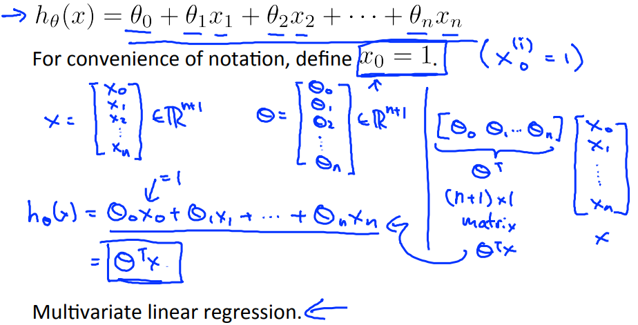
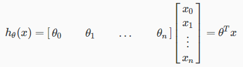

# Multiple Features
Week1では変数が1つの線形回帰を扱った  
ここからは変数がnつの線形回帰を扱う

## Multivariate linear regression の変数
変数が複数あるLinearRegression(線形回帰)のことを  
MultivariateLinearRegression(多変量線形回帰?)と呼ぶ  

例えば 1週目で扱った 家の広さ(x) と 家の価格(y) の場合で考えると  
xとして階数や築年数が追加された以下のようなイメージ  
  
これ以降は以下の通り変数定義を追加する
* n : 変数の数を表す(ちなみにweek1にあったようにmはトレーニングセットの数)
*  : i番目のトレーニングセットを指す  
  例えば  は 2行目(1416 から始まるcolumn)のトレーニングセットを指す
*  : column=i の row=j の項目を指す  
  例えば  は column=2, row=3 の2  
  つまり TrainingSet3行目のNumberOfFloorsを指す

## Multivariate linear regression の式
複数の変数を持つ仮説は以下の式で表すことができる
  
またこの式はベクトルを用いることでと表すことができる
  
