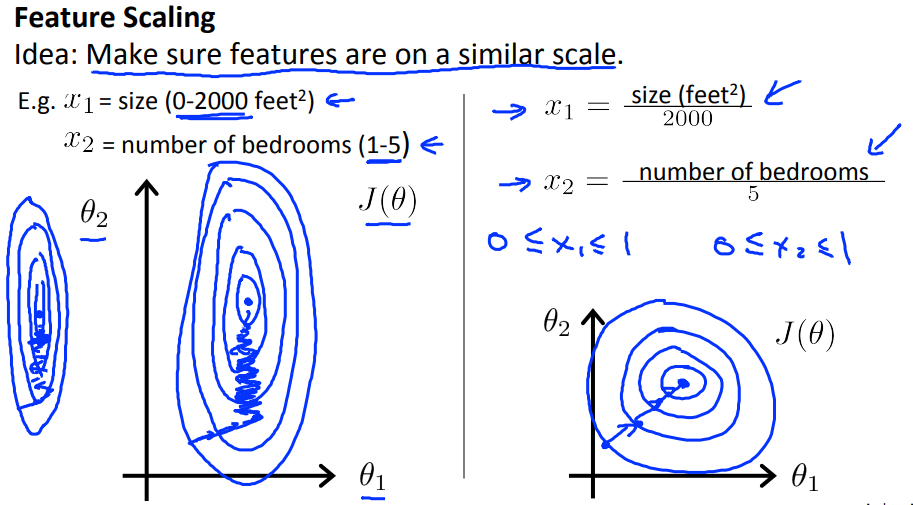
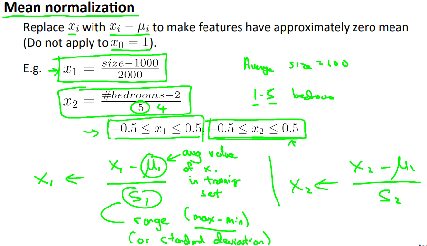

# Gradient Descent in Practice I - Feature Scaling
Gradient Descentをより早く収束させるための手法 その1  
Feature Scalingについて学ぶ

## Gradient Descentが収束するステップについて
仮説の各パラメタで 値域が異なると  
Gradient Descentが収束/最適値を求めるのに時間がかかる  
// なぜなのかの詳細は理解できていない...  
  
仮説のパラメタの値域(ここではθ1, θ2)が大きく異なると  
等高線は上図の左のように細長い円を描き 最適値を求めるには多くのステップが必要  

対して パラメタが近い値域をとる場合 ステップ数が少なく済む  

## Feature Scaling, Mean normalization とは なにか
パラメタの値域を近づけるための手法  
各x(i)の値を以下の値域で収まるよう調整する  
およそ-3 <= x(i) <= 3 または -1/3 <= x(i) <= 1/3   

実現するため 各x(i)を以下で代入する  

* : パラメタi(サイズ/広さなど)の変数の平均  
  つまり広さパラメタ()だったら =2000
* : 値の範囲のこと (max - min)で求める

例えば 以下のように求める  

