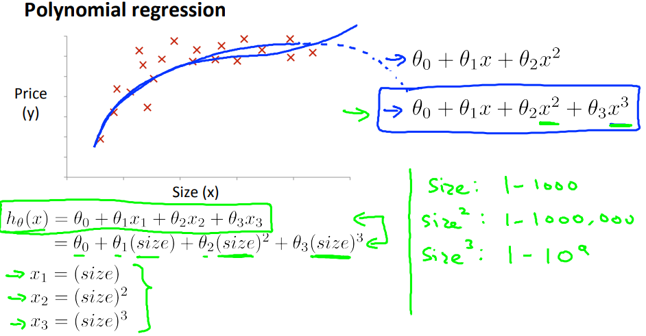
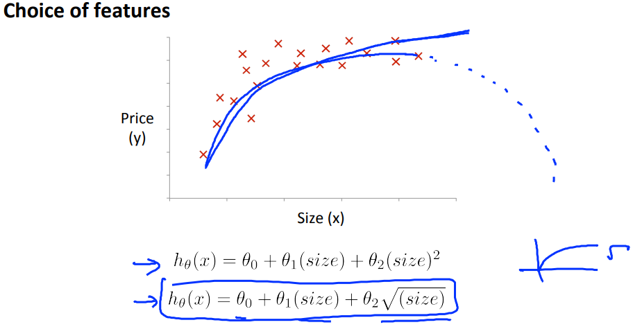

# Features and Polynomial Regression
多項式回帰について学ぶ  

## Polynomial Regression
以下のデータセットに最適な線を考える場合  
1次式(直線)よりも2次式・3次式を適用すると より最適な仮説が考えられる  
  
の仮説を用いると  
Size(x)が一定値を超えると Price(y)が減算されてしまい 適切な仮説とは言えない  

の仮説を用いると  
Size(x)が一定値を超えても Price(y)が減算されない仮説になり より最適な仮説になる

3次式を用いた場合Size(x)が一定値を超えると Price(y)が大きく増加する  
これが適さない場合は √を用いると より最適な仮説が導き出せることがある    
  
// √を含む式は上記図の右下にあるように xが一定値を超えると  
// yが非常に緩やかに増加するような線になる

このように 仮説の 次元数を変えたり √を用いたりすることで  
曲線の傾きをコントロールすることが出来る  

ここで覚えておきたいのは 次数を大きくすると  
それに伴い 変数の値が非常に大きくなるため(収束するのに時間がかかる)  
前出のFeature Scalingが大事になってくるということ
