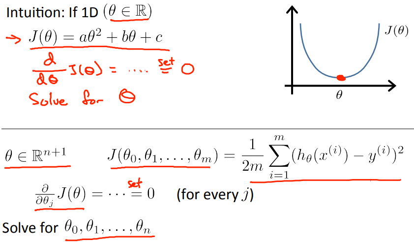
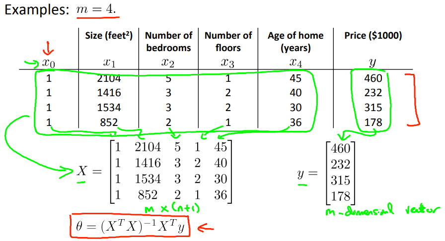
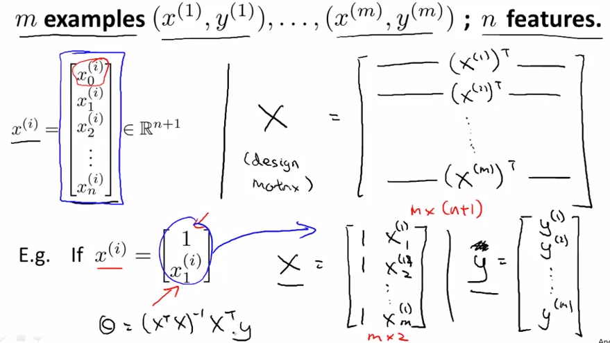
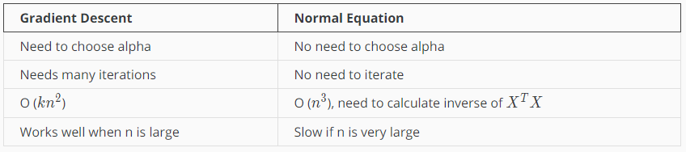

# Normal Equation(正規方程式)
最適なパラメタを求めるのに使用可能な方法の1つ  
既に出てきたパラメタを求める方法Gradient Descentと比較しながら学ぶ  

## Normal Equationの考え方
Gradient Descentで最適なパラメタを求めるには  
イテレーションが必要になり 計算量が多くなりやすい  

Normal Equationでを求めると  
GradientDescentのようなイテレーションが不要になる  

パラメタがθだけのシンプルな例で考え方を示すと以下の通り  
つまり 仮説についてθで微分し それが0になるとき θが最小である という考え方  
  
微分はある時点の勾配を示すため  
勾配が0になる点 = 線の頂点 となり J(θ)の最小値を得ることが出来る  

これを各パラメタ(, , ..., )について解決すれば  
各パラメタの最適値が取得できる という考え方  

## Normal Equationのアルゴリズム(式)
これは
とも表現できる  
// らしい...何故このように表現できるのか理解できていない  
  

(feature matrix), X(design matrix), (vectorized y)について  
  
* (feature matrix): n+1次元ベクトルで i番目のトレーニングセットのfeatureを各行に保持  
* X(design matrix): m*(n+1)の行列で各行にのトレーニングセットのfeaturesを保持  
* (vectorized y): m次元のベクトルで 各行にトレーニングセットのyを保持

## Gradient Descent と Normal Equation の比較
それぞれ 以下の特徴がある  
  
パラメタの数が多い場合(いまのコンピュータの性能だと 1万以上?)は  
GradientDescentの方が早く(少ない計算量で) 最適なパラメタが取得でき  
それ以外の場合は Normal Equationの方が早い(少ない計算量)で済む
