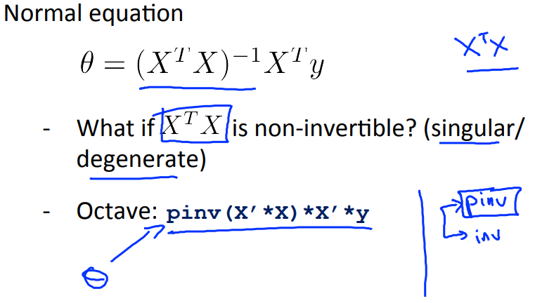
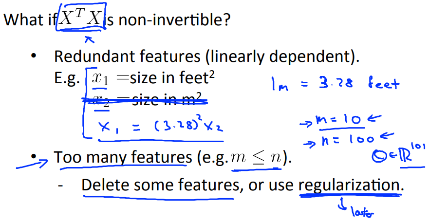

# Normal Equation Noninvertibility
https://www.coursera.org/learn/machine-learning/lecture/zSiE6/normal-equation-noninvertibility  
非可逆行列(逆行列が存在しない行列)の正規方程式について  

## 非可逆行列の正規方程式について
正規方程式を求める式はと表現できるが  
逆行列が存在しない行列がある(が疑似逆行列となる行列)  
  
Octaveではpinv関数を用いることで 必要に応じ 逆行列/疑似逆行列 が取得できる  
そのため  ではpinv関数を使用すれば問題ない  

疑似行列については 以下が理解し易かった  
http://zellij.hatenablog.com/entry/20120811/p1

## どのようなケースで非可逆行列になるか
例えば 以下のケースで非可逆行列になる  
* 強い関連を持つパラメタが含まれるとき (以下の上のケース)  
* パラメタが多い(トレーニングセットの数より多い)とき (以下の下のケース)  
  
このようなときは 以下の対処を採る必要がある  

* 強い関連を持つパラメタを削除する(1つだけ残す)  
* 多すぎるパラメタのうちいくつかを削除したり  
  正規化(この後で説明がある)したりする  
