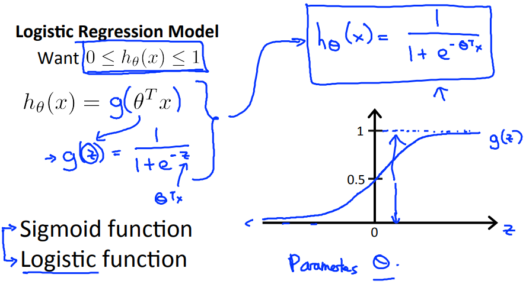
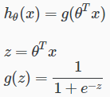
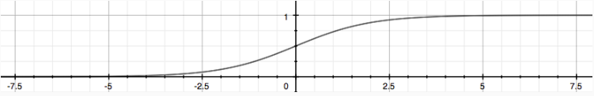
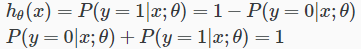

# Hypothesis Representation
LogisticRegressionの仮説の表現方法について扱う  

## Hypothesis Representation of Logistic Regression
Classificationに適した予測値(0 <= hθ(x) <= 1)になる仮説にするため  
LinearRegressionの式()に手を加え  
LinearRegressionの式をパラメタに持つ仮説を考える  
  
g(z)の式は SigmoidFunction または LogsticFunctionと呼ぶ式のため  
この仮説をLogisticRegressionと呼ぶ  

g(z)の式についてまとめる以下の通り  
  

シグモイド関数を図示すると以下の通り  
  
Xが増加するとYは1へ 逆に 減少すると0へ 漸近するグラフ  

LogisticRegressionでは Yを1に分類される確率として扱う  
つまり Y=0.7の場合は 1に分類される確率が70%であることを示す  
また 0に分類される確率が30%であるということも示す  

変数x, パラメタθが与えられる式で y=1になる確率は P(y=1|x;θ)と表現できる  
この式を用いて y=0になるときの確率などを以下の式で表現できる  
  
