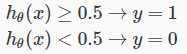
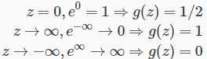
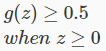
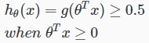
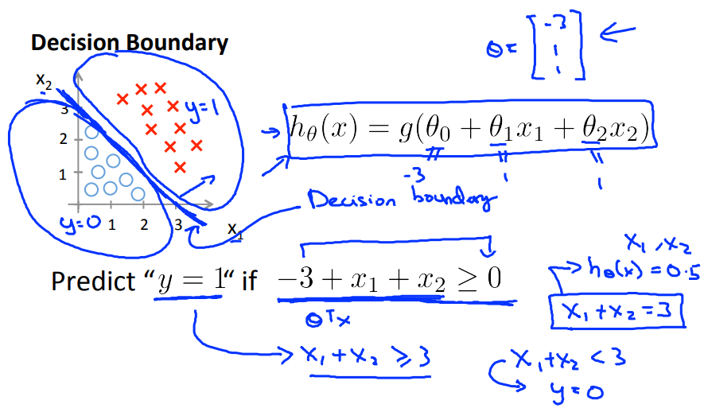

# Decision Boundary
ClassificationのDicisionBoundryについて扱う  

## Logistic Regression の考え方
Classificationの仮説は 予測値に応じ 以下のような分類をするもの  
  
このケースは 1である確率が50%以上なら1に分類  

前出の通り シグモイド関数の式は以下の通り  
  

この式は パラメタz と 出力値 に以下の関係がある  
  

これらから シグモイド関数の出力値が0.5以上になるのは  
パラメタzが0以上のとき ということが分かる   
  

これをLogisticRegressionにあてはめると  
が0以上のとき 仮説の出力値が0.5以上と考えることができる  
  

つまり が0以上のときはy=1  
が0未満のときはy=0と考えることができる  
  

## Decision Boundaryとは なにか
y = 0 とするか y = 1 とするか どちらに分類するかを分ける線のこと  

例えば 以下の仮説を考えるとき  
Decision Boundaryは以下の直線となり  
この線によって分けられた それぞれの領域が y=0 または y=1 で分類できる  
  
fθ(x)(-3 + x1 + x2) >= 0 は x1 + x2 >= 3 と変形でき  
この条件を満たすとき つまり 直線より上に分類されるとき y=1となることが分かる  
