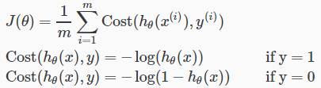
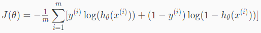
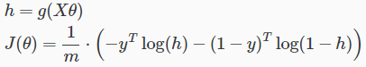
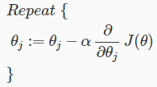
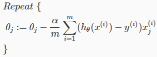
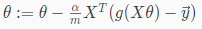

# Simplified Cost Function and Gradient Descent
LogisticRegressionのCostFunctionをシンプルに表現する方法と  
LogisticRegressionのCostFunctionにGradientDescentを適用する方法について扱う  

## Simplified Cost Function of Logistic Regression
前出の通り LogisticRegressionでは以下のCostFunctionを使用する  
  
yは常に0または1のため この2つの式は以下1つの式にまとめられる  
  
yが1のときは2項目が消え 1項目のみが残り  
yが0のときは1項目が消え 2項目のみが残る そのため元の式と内容は同じ  

このCostFunctionの全体を式にすると以下  
  
またこの式をベクトル化すると以下  
  

## Gradient Descent of Logistic Regression
GradientDescent(前出の以下)を  
  
をLogisticRegressionのCostFunctionに適用すると以下の通り  
  
LinearRegressionのときと同様 各は同時に更新する必要がある  

また ベクトル化すると以下  
  
