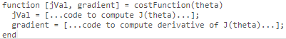

# Advanced Optimization
LogisticRegressionのより洗練されたCostFunctionについて扱う

## Advanced Optimizationについて
GradientDescentの代わりに以下のアルゴリズムを使用することができる  
"Conjugate gradient", "BFGS", and "L-BFGS" など  

これらのアルゴリズムはより洗礼されており 利用することで以下のメリットがある  
* α(学習率)を指定する必要がない  
* 最適なパラメタを(GradientDescent)より早く算出できることが多い

ただし アルゴリズムが非常に複雑なため 自身で実装すべきでない  
代わりに ライブラリにより提供された実装を用いると良い

## OctaveでAdvanced Optimizationを利用する方法
Octaveでは標準ライブラリに含まれるfminunc関数が利用可能  

fminuncに指定する引数として以下を準備する  
  
* jVal は J(θ)の計算式  
* gradient は 各θの勾配の計算式  

以下でfminuncを実行する fminuncの引数で上記で準備した関数を指定する  
  
これで最適化されたθが取得できる(optThetaに設定される)  
