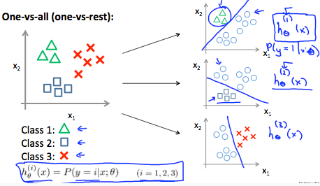
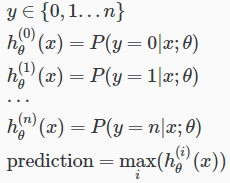

# Multiclass Classification: One-vs-all
https://www.coursera.org/learn/machine-learning/lecture/68Pol/multiclass-classification-one-vs-all  
Multiclass Classificationについて扱う  

Multiclass Classificationとは分類(y)を0/1だけでなく  
1/2/3/4/.../nのn個の分類を扱うClassificationを指す  

## Multiclass Classificationの考え方
3つに分類するケースを考える  

Class1を分類する分類器, 2を分類する..., 3を...の3つの分類器を作成すれば良い  
  
それぞれの分類器を使用し 各Classである確率を算出し  
最も大きな確率のClassに分類されるであろう と考える

これを関数にすると以下の通り  
  
