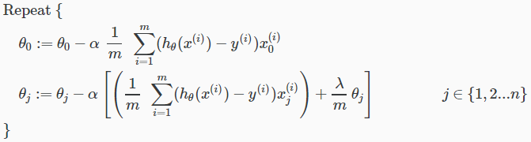
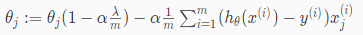
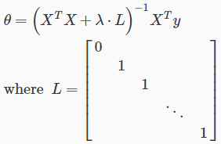

# Regularized Linear Regression
https://www.coursera.org/learn/machine-learning/lecture/QrMXd/regularized-linear-regression  
LinearRegressionをRegularizedするための考え方について扱う  

## LinearRegressionをGradientDescentでFittingするときのRegularization
GradientDescentにRegularizationするための式を加え以下となる  
  
前出の通りはNormalizedする必要がないため式がわかれる  
がNormalizedのための項  

また のための式は以下に変形できる  
    

## LinearRegressionをNormalEquationでFittingするときのRegularization
同様に RegularizedなNormalEquationの式は以下  
  
λ*Lの項がNormalizationのための項  
Lは上記の通り diag=(0, 1, 1, ..., 1)の単位行列 (用語間違ってるかも...)
