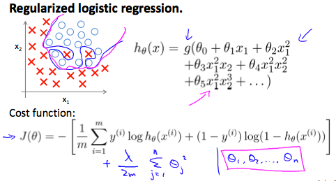
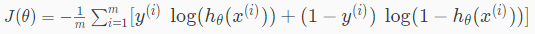
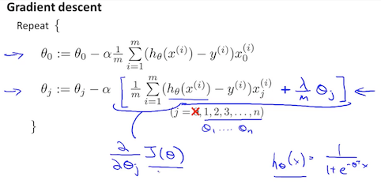
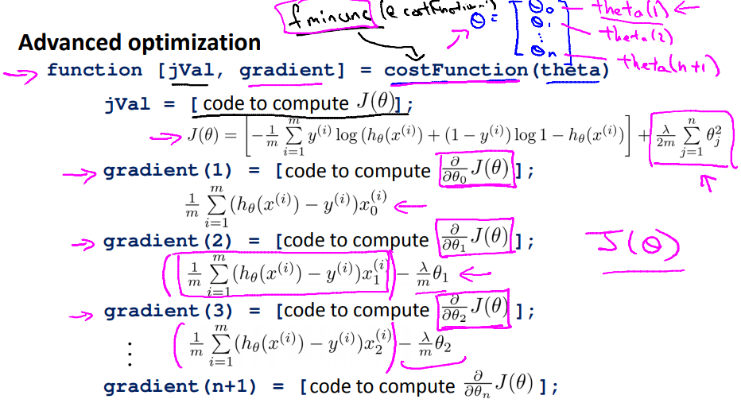

# Regularized Logistic Regression
LogisticRegressionをRegularizedする方法について扱う  

## LogisticRegressionのRegularization
LinearRegressionと同様 LogisticRegressionでもOverfittingが発生し得る  
以下の青線がOverfittingな状態  
LinerRegression同様 CostFunctionをRegularizedし Overfittingを解消する    
  
 がRegularizedするための項  

前出の通り LogisticRegressionのCostFunctionは(≠Regularized)以下
  

Regularizedすると以下

このLogisticRegressionのCostFunctionは  
(LinearRegressionと同様) 以下のGradientDescentに適用できる  
  
がLogisticRegressionの式  となる  

## AdvancedOptimazationのRegularization
LogisticRegressionのより洗練されたCostFunctionについて  
Regularizationすると以下の通り  
  
