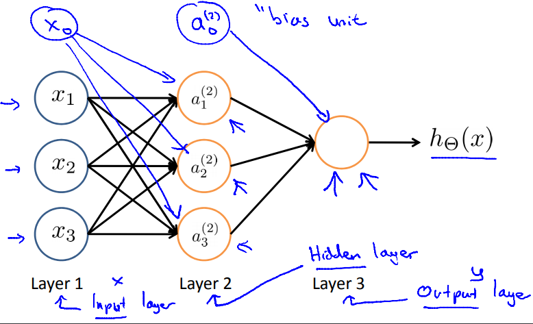
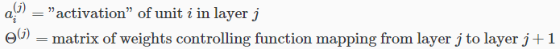
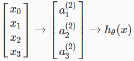
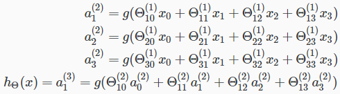

# Model Representation I
ニューラルネットワークについて扱う  
ここではニューラルネットワークの表現について扱う  

## ニューラルネットワークの用語
ニューロンにおいて Input=dendrites Output=axons

ニューラルネットワークにおいてdendrites, axonsは以下に対応  
* dendrites: などのInputFeatures  
  特にはBiasUnitと呼ばれ 常に1  
* axons: 結果の仮説関数  

ニューラルネットワークにおいてもClassification()を使用  
Sigmoid(Logistic) ActivationFunctionとも呼ぶ  
パラメータθは weights とも呼ぶ  

InputNodesのLayer1はInputLayerとも呼ばれ 別のNode(Layer2)へ入力される  
最終的なOutputは仮説関数でOutputLayerとも呼ばれる  
  
// は常に1のため書いたり書かなかったりする  
InputLayerとOutputLayerの間にLayers(IntermediateLayers)を持つことができ  
これはHiddenLayersと呼ぶ  
この層のノードは
とラベリングされActivationUnitsと呼ばれる  
  

## ニューラルネットワークの表現・関数
例えば1つのHiddenLayerを持つNeuralNetworkは以下で表現できる  
  
各ActivationNodeの値は以下で求められる  
  
つまり この例では 各ActivationNodeは 3*4の行列パラメタで求められる  
// よく分かってない...の3行  
// 各行は  
// つまり入力(BiasUnitがあることに注意)・パラメタ積の和で求められるという話?

これを一般化すると jレイヤにユニットがあり j+1レイヤにユニットがあるとき  
の行列は  * (+1) となる ということ  
