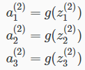
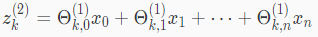
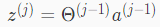
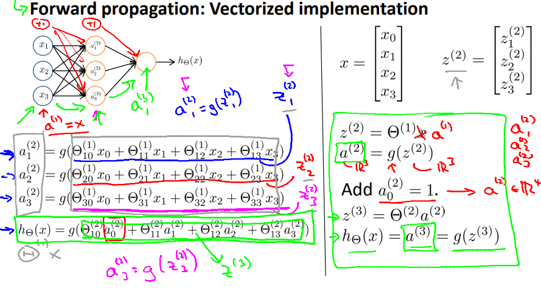
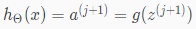

# Model Representation II
https://www.coursera.org/learn/machine-learning/lecture/Hw3VK/model-representation-ii  
ニューラルネットワークのベクトル化について扱う  

## ニューラルネットワークのベクトル化
前回あったように ニューラルネットワークは以下の式で表現できる  
  

ベクトル化を考えるために  
新しい変数を定義し これをシグモイド関数gのパラメタとする  
zを使うと 上記ActivationNodesの式は以下で表現できる  

zは例えばのとき つまり2層目のノードkについては以下となる  
  

xとのベクトルは以下なので  
  

jレイヤのzベクトルは以下で表現できる  
  

このようにベクトル化していく流れをForwardPropagation(順方向伝播?)とも呼ぶ
  

仮説関数のベクトルを汎化すると以下  
  
Outputへの最後のステップがやっていることはLogisticRegressionと全く同じ  
// と言ってくれているが 未だいまいちピンと来ない...  
